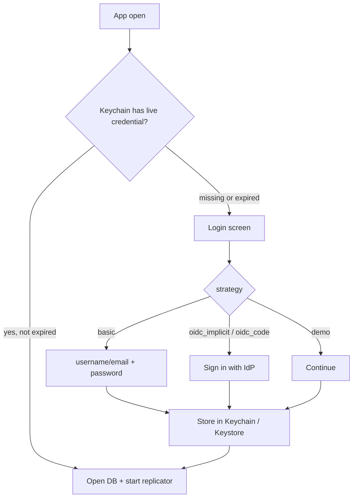
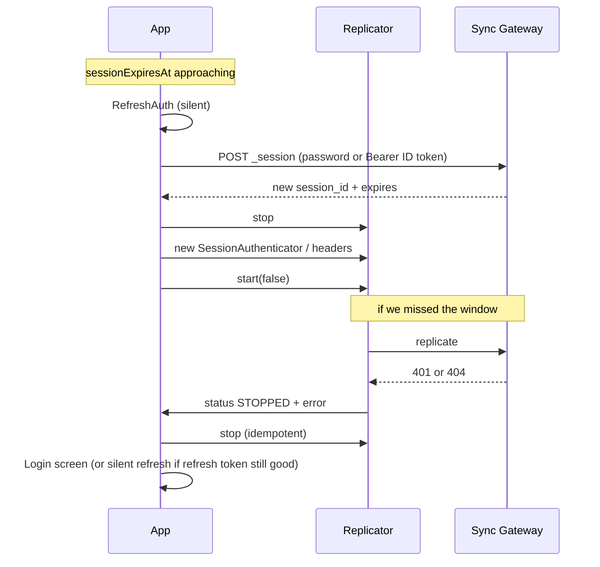

# Auth — login page and replicator

| Field | Value |
| --- | --- |
| Title | Sync Gateway login, tokens, expiry |
| Repo | [Fujio-Turner/mobile_field_service](https://github.com/Fujio-Turner/mobile_field_service) |
| Author | Fujio-Turner / mobile_field_service |
| Date | 2026-09-06 |
| Status | Implemented (`basic` + `demo`; OIDC screens stubbed behind env) |
| Design | [DESIGN.md](./DESIGN.md) |

How the **login screen** gets a credential, how the **replicator** presents it to Sync Gateway / App Services, where it is stored, and what happens when it **expires**.

Couchbase Lite for React Native authenticates a replicator with **`BasicAuthenticator`**, **`SessionAuthenticator`**, or **custom headers** (Bearer). There is no CBL 2.x `OpenIDConnectAuthenticator` on this plugin.

References:

- [OIDC implicit flow + Sync Gateway](https://www.couchbase.com/blog/oidc-implicit-flow-client-authentication-couchbase-sync-gateway/)
- [OIDC authorization code flow + Sync Gateway](https://www.couchbase.com/blog/oidc-authorization-code-flow-client-authentication-couchbase-sync-gateway/)
- [CBL RN remote sync — client auth + custom headers](https://cbl-reactnative.dev/DataSync/remote-sync-gateway)
- App replication how-to: [guides/REPLICATION.md](../guides/REPLICATION.md)
- Env / Keychain catalog: [guides/SETTINGS.md](../guides/SETTINGS.md)
- [SG user authentication](https://docs.couchbase.com/sync-gateway/current/security/authentication-users.html)

---

## Build-time choice (not a runtime toggle in v1)

**Default: username / password.** Other strategies are compiled in via env so a company build is one mode:

| `EXPO_PUBLIC_AUTH_STRATEGY` | Login UI | How the replicator authenticates |
| --- | --- | --- |
| **`basic`** (default) | Email/username + password | `BasicAuthenticator` **or** app `POST /{db}/_session` then `SessionAuthenticator` |
| **`oidc_implicit`** | “Sign in with {IdP}” | Device gets a signed ID token; **`POST /{db}/_session` with `Authorization: Bearer <id_token>`** → `SessionAuthenticator`. Do **not** put the JWT on every replicator request (tokens are large). |
| **`oidc_code`** | “Sign in with {IdP}” (browser redirect) | Sync Gateway runs authorization-code; client ends with an SG session cookie |
| **`demo`** | Known personas (Jon / Maya Chen / Priya) or any other id as Jon; no network | Synthetic session in Keychain; replicator not started |

v1 ships **`basic`**. OIDC screens and replicator header wiring are implemented behind the same `AuthPort` so a later build can flip the env without rewriting Today / CBL.

`users` documents remain **profiles** (`employeeId`, email). They are not a password store.

---

## Login page (`app/login.tsx`)



**Basic UI:** one identifier field (email or username), password, Sign in, offline error, invalid-credential error. Fields use `FieldInput` (`showSoftInputOnFocus`). No “remember password” checkbox — the OS secure store **is** the remember. **Demo UI:** identifier only; any non-empty value; no server. `.env.example` uses **demo**.

**OIDC UI:** no password field. One button. iOS: `ASWebAuthenticationSession` / Expo AuthSession. Android: Chrome Custom Tabs. Never a WebView that can see the password on the IdP page if the IdP supports the system browser.

After success, navigate to DB open → Today. Do not write any secret into CBL.

---

## Three ways onto the replicator

### 1. Username + password (default)

Two equivalent client patterns; pick **session** for expiry control:

| Pattern | Replicator | Expiry handle |
| --- | --- | --- |
| **A. BasicAuthenticator** | `new BasicAuthenticator(user, password)` | CBL does `POST _session` internally and keeps the cookie for the replicator lifetime. App still stores password in the enclave to rebuild the replicator after process death. |
| **B. SessionAuthenticator (preferred)** | App `POST /{db}/_session` with basic auth → `{ session_id, expires, cookie_name }` → `new SessionAuthenticator(sessionId, cookieName)` | App **owns** `expires`. Pre-refresh and 401 path are explicit. |

v1 **basic strategy uses B**. Password is used only to mint/refresh a session, then the replicator sees the session cookie, not the password on every WebSocket frame after start (CBL still may send basic on A).

```http
POST /mfs/_session
Authorization: Basic base64(user:pass)
```

Response (shape):

```json
{
  "session_id": "904ac010862f37c8dd99015a33ab5a3565fd8447",
  "expires": "2026-09-04T18:00:00.000Z",
  "cookie_name": "SyncGatewaySession"
}
```

```typescript
config.setAuthenticator(
  new SessionAuthenticator(sessionId, cookieName ?? 'SyncGatewaySession')
);
```

### 2. OIDC implicit — token on the device

From the Couchbase implicit-flow write-up:

1. App obtains a **signed** ID token (RS256) from the IdP on device.
2. **Always exchange for an SG session** (ID tokens are large):

```http
POST /mfs/_session
Authorization: Bearer <id_token>
```

SG validates issuer/audience, may auto-register (`oidc.providers.*.register`), returns `session_id` + **`expires`**. Replicator uses `SessionAuthenticator(session_id)`. Honor TTL: pre-refresh and 401/404 as below.

`EXPO_PUBLIC_AUTH_BEARER_ON_REPL=true` (JWT on every replicator request via `setHeaders`) is **not** the default and should stay off unless a proxy demands it.

The app **must** refresh the ID token (IdP silent refresh / refresh token) **before** the SG session `expires`, then `POST /_session` again. Implicit flow does **not** give SG a refresh token; refresh is **application code**.

### 3. OIDC authorization code — SG fetches the token

SG is the OAuth client. The app opens the provider authorize URL (SG-hosted or IdP), receives a code (or SG completes the code exchange), and ends with an SG **session** the same as (2)-session.

CBL 1.x had `OpenIDConnectAuthenticator`; **CBL 2+ / this RN plugin do not**. The app implements the browser hop. Couchbase still documents this flow; it is more work than implicit. Ship it only when the customer’s IdP forbids implicit/public clients.

End state on the replicator is still `SessionAuthenticator` (not Bearer), unless the customer’s proxy demands `Authorization: Bearer`.

---

## What lives in the secure enclave

iOS Keychain / Android Keystore via `expo-secure-store` (`src/session/enclave.ts`). **Never CBL, never AsyncStorage, never `tmp`.** DB encryption is a **lab toggle default off**; when on, the CBL password string lives here as `mfs.dbkey.*` (readable by the app so it can pass it to `setEncryptionKey` — not a non-exportable hardware Secure Enclave key).

| Key | Contents |
| --- | --- |
| `mfs.auth.strategy` | `basic` \| `oidc_implicit` \| `oidc_code` |
| `mfs.auth.username` | Login identifier (email or username) |
| `mfs.auth.password` | **basic only**, to mint sessions. Omit for OIDC. |
| `mfs.auth.sessionId` | SG `session_id` |
| `mfs.auth.cookieName` | Default `SyncGatewaySession` |
| `mfs.auth.sessionExpiresAt` | Unix seconds |
| `mfs.auth.idToken` | OIDC JWT if Bearer-on-replicator |
| `mfs.auth.refreshToken` | OIDC refresh token if the IdP issued one |
| `mfs.auth.idTokenExpiresAt` | JWT `exp` |
| `mfs.dbkey.<employeeId>` | DB encryption string (only if Settings / debug encryption is **on**) |
| `mfs.cbluid.<employeeId>` | Native CBL unique open-name for leftover-handle close (not a secret) |

Logout deletes **auth.*** keys (session, password, tokens). DB encryption key stays unless `LogoutAndWipe`.

“Store credentials and call them later” = process death / next launch: `RestoreSession` reads the enclave, skips the form if `sessionExpiresAt > now + skew`, opens DB, starts replicator.

---

## Expiry — honor it

Two clocks (either can fire first):

| Clock | Source | When it dies |
| --- | --- | --- |
| SG session | `_session.expires` | Replicator gets **401 Unauthorized** (CBL also treats **404** as **permanent** — replicator **STOPPED**) |
| OIDC ID token | JWT `exp` | Bearer header rejected; same STOPPED path if used on the replicator |

CBL RN: **401** and **404** are **fatal**. Continuous mode does **not** retry them. Activity → `STOPPED`. Transient codes (408, 429, 5xx, DNS) go `OFFLINE` and retry.

User-visible: “not authorized” on an active app. **Do not** spin reconnect with the dead cookie.



### `OnReplicatorAuthFailure`

Listen on `replicator.addChangeListener`:

1. `error` present and HTTP/CBL code is **401**, **10401** (session), or **404** (CBL permanent).
2. `replicator.stop()`.
3. Try **`RefreshAuth`** once (silent). If it succeeds, rebuild replicator, `start(false)`, stay on Today.
4. If refresh fails (password changed, IdP session dead, offline): clear session keys (keep password only if you still want the form pre-filled — v1 **clears password on 401** so a stolen phone after expiry cannot mint sessions). Navigate to **login**.
5. Local CBL **stays open**. The tech keeps working offline. Sync banner: “Sign in to sync.”

Do not `LogoutAndWipe` on 401.

### `RefreshAuth` (pre-re-authorize)

Run:

- On a timer while the app is foregrounded, **T = 5 minutes** before `min(sessionExpiresAt, idTokenExpiresAt)`.
- On `AppState` `active`.
- Immediately after a 401 **before** showing login.

| Strategy | Silent refresh |
| --- | --- |
| basic | `POST /_session` with stored username + password. Replace session id + expires. Rebuild replicator. |
| oidc_implicit + session | Silent IdP refresh → new ID token → `POST /_session` with `Authorization: Bearer`. Replace session. Rebuild replicator. |
| oidc_implicit + Bearer header | Silent IdP refresh → `setHeaders({ Authorization: 'Bearer ' + newToken })`. Rebuild replicator (headers are fixed at create time). |
| oidc_code | Repeat code hop only if refresh token missing; else same as session mint. |

If silent refresh needs UI (IdP interaction), show login — do not block the WO editor.

Rebuilding the replicator: `stop` → `Replicator.create` with the **same** collection allow-list → `start(false)` (do **not** reset checkpoint).

---

## Operations (catalog)

#### `LoginRemote`

| Strategy | Inputs | Network |
| --- | --- | --- |
| basic | `usernameOrEmail`, `password` | `POST /{db}/_session` (Basic) |
| oidc_implicit | IdP UI | IdP token + optional `POST /_session` Bearer |
| oidc_code | IdP / SG redirect | ends in `_session` cookie |
| demo | identifier | none |

Success: write enclave; resolve `employeeId` (JWT claim or subsequent `users` pull); open DB; start replicator. Failure: 401 invalid; network error.

#### `RestoreSession`

Enclave has session (or Bearer) with `expiresAt > now + 30s` → open DB, start replicator. Else login. Offline: open DB **if** encryption key present; replicator `OFFLINE`; do not treat expiry as wipe.

#### `RefreshAuth`

See table above. No UI if silent succeeds.

#### `OnReplicatorAuthFailure`

401 / 10401 / 404 → stop → `RefreshAuth` once → login if still dead.

#### `Logout`

Stop replicator, close DB, delete **auth.*** enclave keys (including password). Keep `mfs.dbkey.*`.

---

## Login screen copy (basic)

- Title: Sign in
- Fields: Email or username, Password
- Primary: Sign in
- Errors: “Wrong email or password.” / “Can’t reach the server. You can still open last session if it hasn’t expired.”
- Footer: app version (same string as `audit.*.ver`)

OIDC: replace fields with one IdP button; same errors for cancel / network.

---

## Security notes

| Do | Don’t |
| --- | --- |
| Keychain / Keystore | CBL, logs, `tmp`, screenshots of the password field (`secureTextEntry`) |
| `wss://` + system CAs in prod | Basic auth on cleartext `ws://` in prod |
| RS256 ID tokens (SG requirement) | HS256 / unsigned JWT |
| Rebuild replicator on new session | Leave a STOPPED replicator running retries (it won’t; 401 is fatal) |
| Pre-refresh at T−5 min | Wait for 401 in the basement with no radio if you could have refreshed in coverage |

---

## Feature flags

Auth env is listed here; **every** app setting (Profile, debug, Keychain, map, tracking, replication schema) is in [guides/SETTINGS.md](../guides/SETTINGS.md).

```
EXPO_PUBLIC_AUTH_STRATEGY=basic|oidc_implicit|oidc_code|demo
EXPO_PUBLIC_SG_URL=wss://…
EXPO_PUBLIC_SG_DB=mfs
EXPO_PUBLIC_OIDC_ISSUER=          # implicit / code (not read by src/ yet)
EXPO_PUBLIC_OIDC_CLIENT_ID=
EXPO_PUBLIC_OIDC_SCOPES=openid email profile
EXPO_PUBLIC_AUTH_BEARER_ON_REPL=false   # true → custom header instead of SessionAuthenticator
EXPO_PUBLIC_SESSION_REFRESH_SKEW_SEC=300
```

Lab SG: `POST /mfs/_session`, guest disabled, optional `oidc.providers` when building `oidc_*`.
