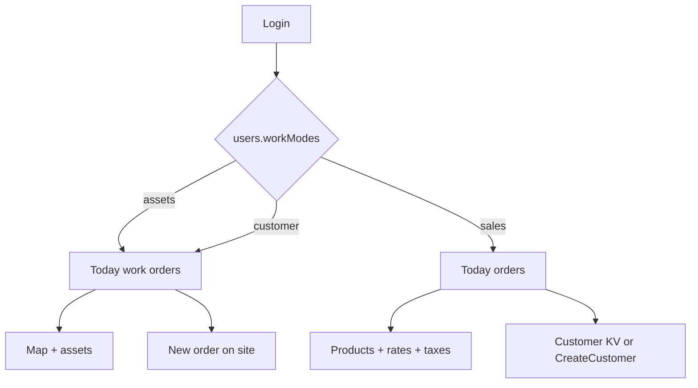

# Day in the life — index

Public HTML: [https://mobile.fuj.io/docs/day-in-the-life.html](https://mobile.fuj.io/docs/day-in-the-life.html).

| Field | Value |
| --- | --- |
| Title | Use-case index (three field apps, one database) |
| Repo | [Fujio-Turner/mobile_field_service](https://github.com/Fujio-Turner/mobile_field_service) |
| Author | Fujio-Turner / mobile_field_service |
| Date | 2026-09-06 |
| Status | Demo login walks all three modes (Jon assets, Maya customer, Priya sales) on iOS. Vector/CLIP still skipped. No credit card payment. |
| Architecture | [DESIGN.md](./DESIGN.md) |
| Roadmap | [ROADMAP.md](./ROADMAP.md) |

This app is **general**. One Couchbase Lite database, one Expo binary. A company turns on the modes it needs (`users.workModes[]`). Today’s board, tabs, and which collections the employee writes change with the mode — the conflict rules do not.

| Mode | Who | Core collections | Story |
| --- | --- | --- | --- |
| **Assets** | Plant / facilities tech | `workorders*` + `assets` | Inspect, repair, move **company** kit |
| **Customer** | Field service at a customer site | `workorders*` + `orders` + `products` + `customers` + `rates` + `taxes` | Deliver or service a work order, then take a **new order** (maybe a **new customer**) on site |
| **Sales** | Route sales | `orders` + `products` + `customers` + `rates` + `taxes` | Sell, deliver, next stop |

Shared on every mode: `users`, `messages`, `inventory` (van), `tracking` (TTL 30 days), `tmp`, `emp:{employeeId}` channels, copy-on-write, freeze-on-complete, amendments, `history[]` (what changed + geo/time), movement crumbs in `tracking`. Tab bar: **Today · Notes · Map · Stock · Chat · Profile** (Map hidden in sales).

---

## Walkthroughs

| Use case | File | Persona |
| --- | --- | --- |
| Corporate assets (inspect / repair / move) | [DAY_IN_LIFE_ASSETS.md](./DAY_IN_LIFE_ASSETS.md) | Jon Hale `E-4412` |
| Customer site (delivery + new order / new customer) | [DAY_IN_LIFE_CUSTOMER.md](./DAY_IN_LIFE_CUSTOMER.md) | Maya Chen `E-7703` |
| Pure sales (order + deliver + next) | [DAY_IN_LIFE_SALES.md](./DAY_IN_LIFE_SALES.md) | Priya Shah `E-8801` |

## New / commercial collections

| Collection | Schema | Prefix |
| --- | --- | --- |
| `orders` | [schema/SCHEMA_ORDERS.md](./schema/SCHEMA_ORDERS.md) | `ord:` |
| `rates` | [schema/SCHEMA_RATES.md](./schema/SCHEMA_RATES.md) | `rate:` |
| `taxes` | [schema/SCHEMA_TAXES.md](./schema/SCHEMA_TAXES.md) | `tax:` |
| `tracking` | [schema/SCHEMA_TRACKING.md](./schema/SCHEMA_TRACKING.md) | `track:{day}:{employeeId}` |

`products` and `customers` already exist. Field-created **customers** (walk-up at a site) are new `cus:` documents with `origin: field` — pulled customer master is never mutated.

---

## How the three modes share a phone

A **work order** is labor on a site or asset (inspect, repair, move, deliver, service).  
An **order** is commercial: lines, rates, taxes, customer, money.  
A customer-mode day often has **both**: finish the WO, then write an `ord:` that may spawn a future WO.

Same freeze rule on both: completed document → backend owns it → forgotten facts = **new** document with `amends.id`.
