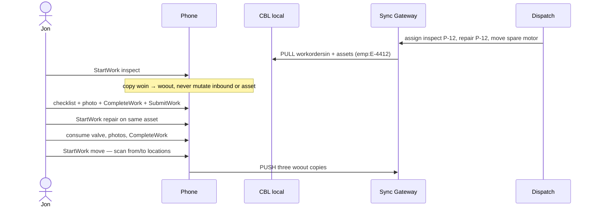

# Day in the life — corporate assets

| Field | Value |
| --- | --- |
| Title | Inspect, repair, move company assets |
| Mode | `assets` |
| Repo | [Fujio-Turner/mobile_field_service](https://github.com/Fujio-Turner/mobile_field_service) |
| Author | Fujio-Turner / mobile_field_service |
| Date | 2026-09-06 |
| Status | Demo seed: Jon Hale `E-4412`, inspect/repair/move + WO-10460 reassigned leftover. Login `jon.hale@example.com`. |
| Index | [DAY_IN_LIFE.md](./DAY_IN_LIFE.md) |
| Architecture | [DESIGN.md](./DESIGN.md) |

Collections in play: `workordersin`, `workordersout`, `assets`, `inventory`, `tasks`, `notes`, `messages`.  
Not the center of this day: `orders`, `rates`, `taxes` (those are customer/sales).

---

## Persona

| | |
| --- | --- |
| Name | Jon Hale |
| Role | Facilities technician |
| `employeeId` | `E-4412` |
| Email | `jon.hale@example.com` |
| `workModes` | `["assets"]` |
| Crew / van | North, `van:12` |
| Day | Friday 4 September 2026 |

**How work reaches the phone.** Channel `emp:E-4412` (SG login `jon.hale@example.com`). Dispatch **or Jon** can create inbound jobs. Dispatch inbound is never patched. Jon may `CreateWorkOrderIn` (`origin: field`) for a walk-up inspect. He copies inbound → outbound, works offline, pushes **his copy**. Asset master stays pull-only.

---

## Screen map

| When | Route | Collection(s) | Operation(s) |
| --- | --- | --- | --- |
| Login | `app/login.tsx` | — | `LoginRemote` |
| Today | `app/(tabs)/index.tsx` | `workordersin`, `workordersout` | `ListTodayWork`, clock. Walk-up `CreateWorkOrderIn`. |
| Job | `app/wo/in/[id]` / `out/[id]` | KV | `GetWorkOrderIn` / `StartWork`; ops/checklist `DoneToggle` |
| Assets | `app/(tabs)/map.tsx` | `assets` | `QueryAssetsInBBox`, `LinkAssetToWork` |
| Parts | `app/(tabs)/inventory.tsx` | `inventory` txs | `ConsumeInventoryOnWork` |
| Chat | `app/(tabs)/chat.tsx` | `messages` | `SendMessage` |
| Notes | `app/(tabs)/notes.tsx` | `notes` | `CreateNote` (general) |
| Profile | `app/(tabs)/profile.tsx` | — | Thumb zone, crumbs count, Settings / debug |
| Search | `app/search/index.tsx` | notes / products / assets FTS | |

---

## Timeline

### 06:40 — Login and Today

Demo login (`EXPO_PUBLIC_AUTH_STRATEGY=demo`) with Jon’s email maps to Jon. Today is **work orders** (`workModes: assets` hides the orders card). The header is a **live clock** and a seconds countdown (next start / late-by / end of day). Rows show number · kind, site, summary, priority stripe, time.

v1 seed board (device-local `scheduled.day`):

| Number | Kind | Asset | Badge |
| --- | --- | --- | --- |
| WO-10470 | inspect | Pump P-12 | — |
| WO-10482 | repair | Pump P-12 | — |
| WO-10490 | move | Motor M-7 yard → Riverside | — |
| WO-10460 | repair | leftover | **Reassigned** |

Tap a row → inbound KV. **Start work** is the filled button in the **bottom dock** (not a row cycle). Hermes has no `crypto`; the new `woout:` id uses expo-crypto.

### 07:00 — Inspect (WO-10470)

Tap → inbound KV (read-only kit). **Start work** copies to `woout:`. Operations (**Site check**, **Close out**) and checklist (**PPE on**) are **outline buttons**; tap fills them (`status: done` / `done: true`). On the map, pins come from local `assets`. Photos as blobs on **outbound**. `CompleteWork` (dock) freezes that copy; `SubmitWork` queues push. Asset master is **not** edited — findings live on the WO.

### 07:45 — Repair (WO-10482)

Same pump. Start copy. Basement, no radio. Photo seized valve, consume `VLV-CHK-4` (`inventory_tx` + materials line, **no stock `save`**), lockout task, chat dispatch for a lift. Complete + submit when LTE returns. Forgotten nameplate photo → **Add follow-up** (`CreateAmendment`), not an edit of the frozen repair copy.

### 11:00 — Move (WO-10490)

Inbound kit: asset M-7, `from` geo (yard), `to` geo (Riverside). Start copy. Scan / confirm asset, photo on truck, photo at destination, `history[]` rows at both ends (lat/lon/dt). Driving between sites also writes `tracking` crumbs when he moves ≥ threshold. Complete. Backend owns the completed move; CMMS updates location from **that document**, not from Jon mutating `assets`.

### 14:00 — Reassigned leftover

WO-10460 still on his outbound list, badge **Reassigned**. He finishes safety work he already started, completes **his** copy. Priya may have her own copy. Two documents, one WO number.

### 16:30 — Out

Profile, sync idle, logout.

---

## Rules this day proves

1. Company assets are **pull catalogs**. Work (inspect / repair / move) is **workordersout**.
2. Copy-on-write, freeze-on-complete, amendments, reassignment — same as the general design.
3. `history[]` lat/lon/time + field diffs on inspect checks, consume, move drop-off. Driving crumbs go to `tracking`.
4. No `orders` / money on this mode unless the company also enabled customer/sales.

## Beat sheet

1. Login `jon.hale@example.com`, `workModes` includes `assets`.
2. Today shows inspect + repair + move inbound, `kind` visible.
3. Inspect: Start → checklist + photo → complete → inbound JSON unchanged, asset JSON unchanged.
4. Repair offline: photo, consume, complete, submit.
5. Amendment after freeze.
6. Move: from/to photos + two `history[]` points (and tracking crumbs in between).
7. Reassigned row still submittable.
