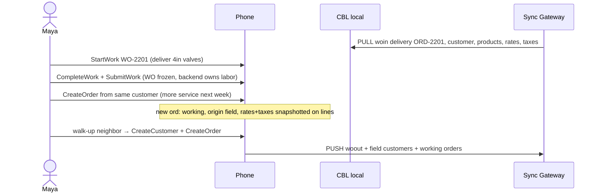

# Day in the life — customer site

| Field | Value |
| --- | --- |
| Title | Deliver / service a work order, then take a new order (maybe a new customer) |
| Mode | `customer` |
| Repo | [Fujio-Turner/mobile_field_service](https://github.com/Fujio-Turner/mobile_field_service) |
| Author | Fujio-Turner / mobile_field_service |
| Date | 2026-09-06 |
| Status | Demo login `maya.chen@example.com` (`E-7703`). Seed delivery WO-2201 + ORD-2201. Walk-up customer at `/customer/new`. |
| Index | [DAY_IN_LIFE.md](./DAY_IN_LIFE.md) |
| Orders schema | [schema/SCHEMA_ORDERS.md](./schema/SCHEMA_ORDERS.md) |
| Rates / taxes | [schema/SCHEMA_RATES.md](./schema/SCHEMA_RATES.md), [schema/SCHEMA_TAXES.md](./schema/SCHEMA_TAXES.md) |

Collections in play: `workordersin` / `workordersout`, `orders`, `products`, `customers`, `rates`, `taxes`, `inventory`, `messages`.

This is the **overlap** day: labor is a work order; money is an order. Maya may finish a delivery WO, write a **new order** for more product/service (later date or while still on site), or a **neighbor / walk-up** wants work — brand-new customer + order. **No credit card payment** in this version — catalog prices are snapshotted. Assume the product is on the truck; do not reserve stock at quote time. She may `CreateWorkOrderIn` for a same-day job ticket, then `StartWork`.

---

## Persona

| | |
| --- | --- |
| Name | Maya Chen |
| Role | Customer field tech |
| `employeeId` | `E-7703` |
| Email | `maya.chen@example.com` |
| `workModes` | `["customer"]` |
| Day | Friday 4 September 2026 |

Channel `emp:E-7703`. Dispatch sends **delivery / service** work orders that point at an existing `order` (`orderId`) and `customerId`. Maya copies the WO, delivers, freezes the WO. Commercial follow-up is a **new** `orders` document — she does not reopen the WO or mutate a pulled order.

---

## Screen map

| When | Route | Collection(s) | Operation(s) |
| --- | --- | --- | --- |
| Today | `app/(tabs)/index.tsx` | workorders + working orders | `ListTodayWork`, `ListTodayOrders` |
| Delivery WO | `app/wo/out/[id]` | `workordersout` | `StartWork`, `CompleteWork` |
| Catalog | `app/(tabs)/inventory.tsx` / products | `products`, `rates`, `taxes` | `SearchProducts`, `PriceLines` |
| New / existing customer | `app/customer/[id].tsx` (`new` or KV) | `customers` | `GetCustomer`, `CreateCustomer` |
| New order | `app/order/[id].tsx` | `orders` | `CreateOrder`, `AddOrderLine`, `SubmitOrder` |

---

## Timeline

### 07:30 — Deliver against an existing order (WO-2201)

Today: **Deliver** WO-2201 for Hartford Water Works, linked `orderId: ord:…` (inbound order, `role: inbound`, pull-only). Maya **StartWork** on the WO (not on the order). She confirms lines vs the order snapshot on the WO, hands over product, photos POD, `history[]` at the dock (qty 10 → 5 is a row with from/to). `CompleteWork` + `SubmitWork`. The **inbound order is untouched**. Backend will mark fulfillment from the completed WO.

### 09:00 — Same site, more work later (new order)

Site supervisor: “Come back Tuesday for a service visit.” Maya **does not** edit the frozen WO. **New order** (`CreateOrder`):

- `origin: field`, `role: working`, `customerId` = existing `cus:`
- Lines from catalog: service SKU, `rateId` labor-hour, `taxIds` CT
- `PriceLines` snapshots unit price + tax onto each line (rates/taxes are pull catalogs; if they change tomorrow the order still has what she quoted)
- `scheduled.day` = next Tuesday
- Optional: request a future WO (`needsWorkOrder: true`) — backend spawns `workordersin` after the order is accepted

She completes/submits the **order**. Freeze + backend ownership — same rule as WOs. If she forgot a line, **amendment order** (`amends.id`), not a patch.

### 10:30 — Walk-up new customer

Neighbor business wants the same service. **No customer master on the phone.**

1. `CreateCustomer` → new `cus:<ulid>`, `origin: field`, `readyToPush: true`. She does **not** edit Hartford Water Works.
2. `CreateOrder` against that new customer, lines + rates + taxes, first `history[]` row at their doorway.
3. Either schedule later (`scheduled`) or convert to a same-day WO if dispatch / rules allow (`CreateWorkOrderFromOrder` is backend or a later op). v1: field creates the **order**; dispatch turns accepted orders into WOs.

### 15:00 — Radio back

Push: completed delivery `woout`, field `customers`, working `orders`. Pulled `rates` / `taxes` / inbound `orders` / inbound `workordersin` never pushed.

---

## Rules this day proves

1. **WO = labor/delivery event.** **Order = commercial document.** Link them (`orderId` on WO, `fulfillment.workOrderOutId` on order) — do not merge into one JSON.
2. Pulled orders and pulled customers are **not mutated**. New business = new documents.
3. Prices and tax **snapshot onto lines** from `rates` / `taxes` at add-line time.
4. Freeze + amendment applies to orders the same way as workorders.
5. Walk-up customer is `origin: field` and is allowed to **push**.

## Beat sheet

1. Login Maya, `workModes` includes `customer`.
2. Delivery WO Start → POD photo → complete; inbound order JSON unchanged.
3. `CreateOrder` for same customer, line priced from `rate:` + `tax:`.
4. `CreateCustomer` + `CreateOrder` for walk-up; two new ids.
5. After order complete, body frozen; Add follow-up creates amendment `ord:`.
