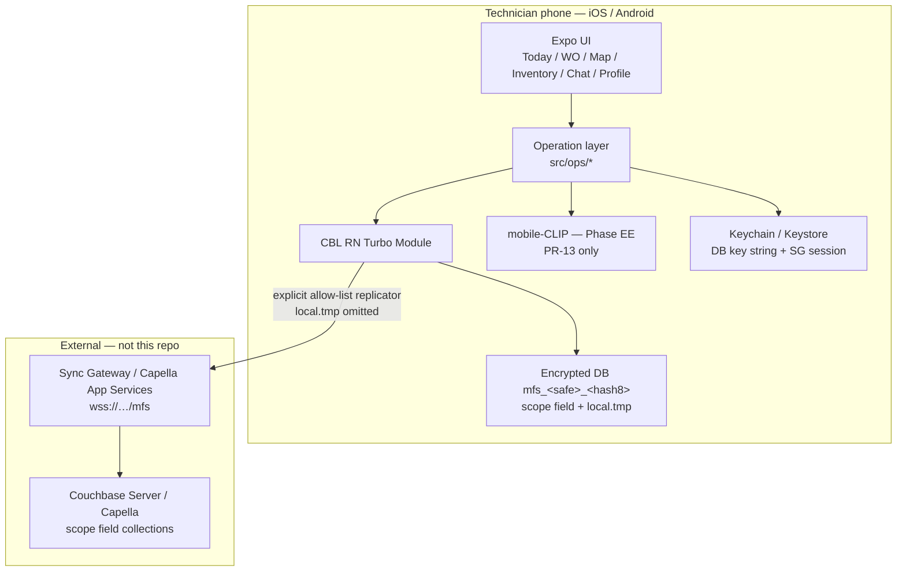
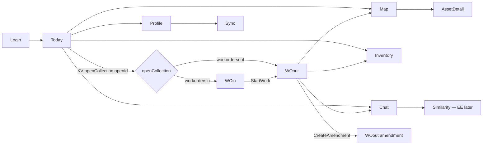
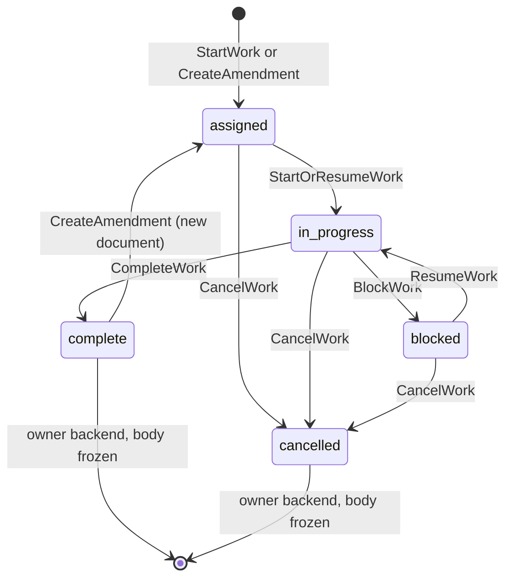
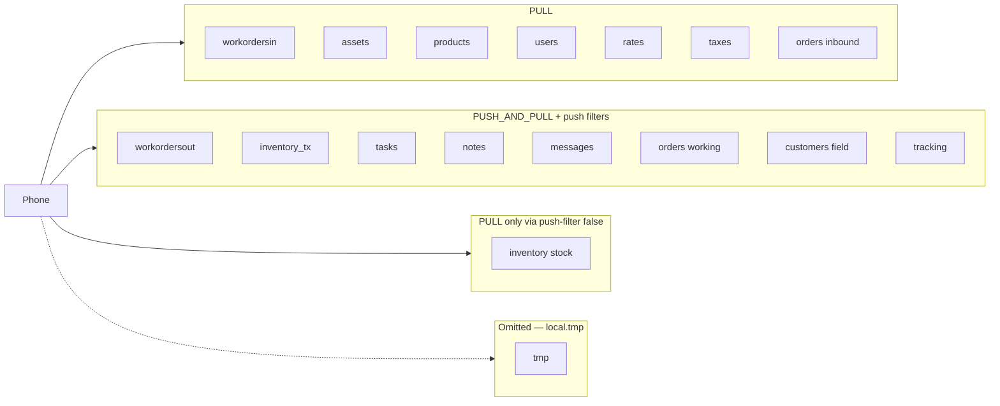

# Mobile Field Service — Design

Public HTML: [https://mobile.fuj.io/docs/architecture.html](https://mobile.fuj.io/docs/architecture.html). This file stays the in-repo spec for engineers.

| Field | Value |
| --- | --- |
| Title | Offline-first field service mobile app |
| Repo | [Fujio-Turner/mobile_field_service](https://github.com/Fujio-Turner/mobile_field_service) |
| Author | Fujio-Turner / mobile_field_service |
| Date | 2026-09-06 |
| Status | Implemented S01–S16 except vector (S15). Three demo modes walk on iOS. |
| Audience | Senior engineers implementing the Expo + Couchbase Lite RN app |

This is a **Fujio-Turner** project, not koten-ai. The architecture, data model, operations catalog, and query contract live here. Use cases: [DAY_IN_LIFE.md](./DAY_IN_LIFE.md) (assets / customer / sales). Auth: [AUTH.md](./AUTH.md). Settings catalog: [guides/SETTINGS.md](../guides/SETTINGS.md). Phased delivery: [ROADMAP.md](./ROADMAP.md). Collection schemas: [schema/](./schema/README.md) (JSON Schema 2020-12 on each file).

**Sibling note.** `utility_field_service` is a UtilityCo / SAP demo scaffold (mock repository, ops dashboard, OpenFreeMap + MapLibre). This product is a **new** phone-first field app. Do not copy that collection set, SAP outbox, or mock-first data layer.

---

## Overview

The phone is a **general field app**. One database, three company modes (`users.workModes[]`):

| Mode | Day in the life | Core data |
| --- | --- | --- |
| `assets` | [DAY_IN_LIFE_ASSETS.md](./DAY_IN_LIFE_ASSETS.md) | `workorders*` + `assets` — inspect, repair, move **company** kit |
| `customer` | [DAY_IN_LIFE_CUSTOMER.md](./DAY_IN_LIFE_CUSTOMER.md) | Work order delivery/service, then **new `orders`** (maybe **new `customers`**) on site |
| `sales` | [DAY_IN_LIFE_SALES.md](./DAY_IN_LIFE_SALES.md) | `orders` + `products` + `customers` + `rates` + `taxes` — sell, deliver, next |

Technicians work with poor or no radio. Today’s board is work orders and/or orders. Open by document ID, capture photos, consume van stock, map assets, price lines from catalogs — all offline. Sync when the network returns.

The app is **React Native + Expo (development builds)** with Couchbase Lite via **[Fujio-Turner/cbl-reactnative](https://github.com/Fujio-Turner/cbl-reactnative)** (`feat/vector-search-support`, CBL **4.x EE** target). Official `@couchbase/couchbase-lite-react-native` 1.1 is **not** SoT. Local data lives in scope `field` (**fourteen** synced collections, including `tracking`) plus scope `local` collection `tmp`. `npm install` fetches `ios/cbl-js-swift` and `src/cblite-js` (npm does not clone those submodules). Vector search is **not** on this train.

**Pulled dispatch inbound is never mutated on the device.** The phone **may create** new inbound work orders/jobs (`origin: field`, new `woin:`). Sync channels by **`emp:{employeeId}`** (SG login username = **email**; see README example). Starting a job **copies** inbound into `workordersout` (new id). The tech works **that copy** offline and pushes it back. When `workordersout.status` becomes `complete` (or `cancelled`), the **body is frozen** and **ownership moves to the backend** — the backend may spawn follow-up tasks and processes. The technician cannot edit that document again. Forgotten details become a **new** `workordersout` (`role: amendment`) that **references** the frozen original (another sheet of paper). The backend consolidates documents that share a work-order number / `source.id`. Multiple outbound documents per work order are expected (eventual consistency). Dispatch may **reassign** inbound while the tech is offline; the Today list badges it **Reassigned**; the tech’s copy still syncs.

User/device mutations append `history[]` (path + from/to + lat/lon/dt). Breadcrumb GPS (moved ≥ N meters) goes to `field.tracking` keyed `track:{day}:{employeeId}` — last 7 days is seven KV gets; each day doc **TTL 30 days**.

Vector similarity (on-device **mobile-CLIP** embeddings + CBL vector index) is a **Phase EE** capability. The React Native plugin **does not currently expose vector indexes or `APPROX_VECTOR_DISTANCE()`**. The schema allows optional `embedding.clip512` (512 floats); v1 **does not write** embeddings until PR-13 when a native model exists. The similarity UI is feature-flagged (`VECTOR_SEARCH_ENABLED && nativeVectorApi`).

---

## Background & Motivation

### Current state

This repository is an Expo SDK **52** / RN **0.76.9** field app (`app/`, `src/ops/*`, `src/db/*`, `src/sync/*`) plus docs. Git **origin** is `Fujio-Turner/mobile_field_service` (not koten-ai). Demo login (`EXPO_PUBLIC_AUTH_STRATEGY=demo`) maps Jon / Maya Chen / Priya (or any other non-empty id as Jon). Development builds only — Expo Go cannot load CBL or MapLibre.

A sibling repo (`utility_field_service`) demonstrates field-ops UX with a **mock** `WorkRepository` and a stub `CblWorkRepository`. It targets a UtilityCo/SAP day-in-the-life demo, not this product’s collection contract or copy-on-write rule.

### Pain points this design addresses

1. **Sync conflicts on shared job documents.** If techs mutate the same inbound work-order document the dispatcher also updates, Couchbase conflict resolvers become product logic. Copy-out removes that class of conflict. Completing a copy **freezes** it so the backend can own it; late info is a new document, not an edit.
2. **Reassignment while offline.** Dispatch may give the inbound job to someone else while the tech is in a basement. The tech still pushes **their** paper; Today shows **Reassigned**. Many documents, one WO number, eventual consistency.
3. **Offline photo, parts, and chat.** Photos are CBL blobs on the outbound job the tech owns. Parts write a movement plus a line on `workordersout`. Chat is `field.messages`, channeled by `employeeId`.
4. **Today list at field speed.** After login the first screen is today’s jobs, `ORDER BY` scheduled time `DESC`, `LIMIT 20 OFFSET n`, infinite scroll. Row tap is a **KV get**, not a second list query.
5. **Place-time + field trail.** User writes append `history[]` (`path`, `from`, `to`, dt, lat/lon). Movement crumbs go to `tracking`.
6. **Honest EE surface.** CBL RN requires an Enterprise license. Database encryption is in. Vector search is **not** in the RN plugin; we do not pretend it is.

### Expected load (device)

| Metric | Planning value |
| --- | --- |
| Jobs per technician per day | 8–20 |
| Photos per job | 5–20 |
| Compressed JPEG size | 200–800 KB |
| Photo bytes per job | ~1–16 MB |
| Photo bytes per day (typical 15×10×400 KB) | ~60 MB |
| Tracking points per day (100 m threshold) | hundreds (hard cap **4000**) |
| Local DB after several days | **hundreds of MB** (photos dominate) |
| Today list page size `X` | **20** |
| Today list local query | p50 &lt; 20 ms, p95 &lt; 50 ms |
| KV `collection.document(id)` | p95 &lt; 10 ms |
| Copy-on-write (JSON, no blob copy) | p95 &lt; 100 ms |
| Blob save 800 KB | p95 &lt; 300 ms |

---

## Goals & Non-Goals

### Goals

- Ship an **iOS + Android** offline-first field app on Expo development builds with CBL RN EE.
- Enforce the founder collection names, audit shape, ID prefixes, and **no-mutate-inbound** rule.
- Channel and assign work by **`employeeId`** (email is login alias). Collection `messages` for job/direct chat.
- Support **assets**, **customer**, and **sales** modes from one schema: work orders for labor/assets; `orders` + `rates` + `taxes` for money; field-created customers allowed.
- Freeze completed outbound documents; forgotten facts go on an **amendment** `workordersout` with `amends.id`.
- Provide a complete **operations catalog** so implementation does not invent field names or SQL++.
- Encrypt the local database at rest (EE AES-256) with a key in the OS keychain/keystore.
- Replicate with collection-level push/pull; **never replicate `tmp`** (`local.tmp`, omitted from the replicator allow-list).
- Vector search via **[Fujio-Turner/cbl-reactnative](https://github.com/Fujio-Turner/cbl-reactnative)** (fork with vector index; native CBL 4.x EE is the target as that fork is brought forward). Official `@couchbase/couchbase-lite-react-native` 1.1 has **no** vector API — do not use it as SoT.
- Phone can **create** inbound work orders/jobs (`origin: field`). Still never mutate dispatch-pulled inbound.

### Non-goals (this product / this repo)

- Web, Windows, or macOS **runtime**. Windows entries in `.gitignore` are for developer machines.
- SAP / UtilityCo integration, allow-listed OData outbox, or Zeus Hub wiring (that is the sibling demo).
- Peer-to-peer CBL sync.
- Storing passwords in Couchbase Lite.
- **Credit card payment** on order create (later; catalog prices only in v1).
- **Inventory reservation / credit hold** on order create (assume product is available).
- Customer-facing chat (employees only).
- POD **signature** pad (photo proof now; signature is a later ROADMAP item).
- Multi-tenant SaaS billing, dispatcher web UI, or backend Sync Gateway config as application code in v1.

---

## Proposed Design

### Stack (locked)

| Layer | Choice |
| --- | --- |
| UI | React Native + Expo **SDK 52**, **development builds** (not Expo Go) |
| RN | **0.76.9** (SDK 52 pin) |
| Node | **≥ 20** |
| iOS | **15.1+** |
| Android | **API 24+** |
| Navigation | Expo Router, phone-first tabs + stacks |
| Database | Couchbase Lite **EE 4.x target** (vector index). Binding fork today still pins 3.2.1/3.3 in places — consume the fork and bump native 4.x there, do not wait on the official plugin. |
| RN binding | **[Fujio-Turner/cbl-reactnative](https://github.com/Fujio-Turner/cbl-reactnative)** (`cbl-reactnative`), including `feat/vector-search-support`. Not official `@couchbase/couchbase-lite-react-native` 1.1 (no vector). |
| Vector | `VectorIndexConfiguration` + `APPROX_VECTOR_DISTANCE` via the fork. CLIP embed still Phase EE (model runtime). |
| Testing | **No EE license required** to compile/run the fork for lab. Shipping encrypted + vector production still needs EE. |
| Engine | `new CblReactNativeEngine()` **once** per process (singleton `DatabaseService`) |
| Query | SQL++ via `database.createQuery` / `Query.execute` / live `addChangeListener` |
| Sync | Collection-based `Replicator.create` + `CollectionConfiguration` → Sync Gateway or Capella App Services |
| Maps | MapLibre (`@maplibre/maplibre-react-native`); OpenFreeMap Liberty **when online**; pins from local CBL |
| Secrets | iOS Keychain / Android Keystore (`expo-secure-store` or react-native-keychain) |
| Camera | `expo-camera` + `expo-image-manipulator` (JPEG compress, thumbnail) |
| Location | `expo-location` |
| New Architecture | `expo.newArchEnabled: true` (required for CBL RN 1.1 TurboModules) |

Binding SoT: [Fujio-Turner/cbl-reactnative](https://github.com/Fujio-Turner/cbl-reactnative) (`feat/vector-search-support` for `VectorIndexConfiguration`). Official plugin docs still useful for replicator/session/headers: [cbl-reactnative.dev](https://cbl-reactnative.dev/), [hybrid React](https://docs.couchbase.com/couchbase-lite/current/hybrid/react.html).

### Runtime topology



### Process bootstrap

1. Register `CblReactNativeEngine` exactly once (`src/db/engine.ts`).
2. After **online** login (or `RestoreSession` when a session cookie is still in Keychain), open the per-employee DB. **Encryption is a lab toggle** (`mfs.dev.dbEncryption`, default **off**). When on: generate 32 random bytes, **base64-encode** them, store as Keychain `mfs.dbkey.<employeeId>`, pass to `setEncryptionKey` (string, not `Uint8Array`). When off: do not call `setEncryptionKey`. Switching the toggle **wipes and reseeds** the local file. An encrypt-mismatch open (leftover encrypted file, toggle off) closes any leftover native handle, deletes the `.cblite2` folder, and reopens to match the toggle.
3. Always set the database directory to the plugin default path before open:

```typescript
import {
  Database, DatabaseConfiguration, FileSystem,
} from '@couchbase/couchbase-lite-react-native';

const config = new DatabaseConfiguration();
config.setDirectory(await FileSystem.getDefaultPath());
if (encrypt) config.setEncryptionKey(keyString); // lab default: skip
const db = new Database(dbNameForUser(employeeId), config);
await db.open();
```

A database encrypted with this RN plugin is **not portable** to other CBL language SDKs.

4. `await database.createCollection(name, 'field')` for the **fourteen** synced collections (including `tracking`). `await database.createCollection('tmp', 'local')` for scratch. Create is idempotent.
5. Create value + FTS indexes (idempotent by name).
6. Optional: copy a **pre-built** seed database on first run (demo).
7. Start replication from an **explicit allow-list** of `field.*` collections via `ReplicatorConfiguration.addCollection`. **Never** add `local.tmp`. Schema is **build-time** (`EXPO_PUBLIC_REPL_SCHEMA`): `simple` = one continuous replicator; `oneshot` = one-shot `workordersin`+`orders`, then one-shot all field collections on a timer + foreground. Each collection config has `channels: string[]` defaulting to **empty**. Lint: any helper that “replicate all collections in a scope” must take a deny-list or allow-list that cannot include `tmp`.
8. Navigate to Today.

**Database name.** One DB per **`employeeId`** so two techs sharing a phone do not mix outbound work. Do **not** only strip punctuation:

```typescript
function dbNameForUser(employeeId: string): string {
  const safe = employeeId.replace(/[^a-zA-Z0-9_-]/g, '_');
  const hash8 = sha256Hex(employeeId).slice(0, 8);
  return `mfs_${safe}_${hash8}`;
}
```

v1 is **one active device per employeeId**. A second phone of the same employee is unsupported (see conflict policy).

### Module layout (target; no code in this PR)

```text
app/                          Expo Router screens
src/db/                       engine, open, collections, indexes, seed
src/ids.ts                    prefixes + ULID
src/audit.ts                  stampAuditCreate / stampAuditUpdate / stampHistory
src/ops/                      one file per operation (catalog below)
src/session/                  SG session, keychain, logout
src/features/                 UI hooks
src/log/                      structured logger (no PII / no doc dumps)
src/metrics/                  counters + timings
```

Do **not** use `_default._default` for app data. Synced product documents live in `field.<collection>`. Device scratch lives in `local.tmp`.

---

## Screens (information architecture)

Phone-first. Large phones and small tablets (≈7") should work; there is no desktop layout and **no Web/Windows runtime**.



| # | Route (Expo Router) | Role |
| --- | --- | --- |
| 1 | `app/login.tsx` | Auth. Default: username/email + password → SG session. Build can switch OIDC implicit or auth-code. Secrets in Keychain, never CBL. See [AUTH.md](./AUTH.md). |
| 2 | `app/(tabs)/index.tsx` | **Today’s work** — clock + countdown, jobs, orders. |
| 3 | `app/wo/in/[id].tsx` | Inbound detail, **read-only**. CTA: Start work / Open existing out (bottom dock). |
| 4 | `app/wo/out/[id].tsx` | Outbound editor: fields, ops/checklist toggles, tasks, photos, parts, submit. |
| 5 | `app/(tabs)/map.tsx` + `app/asset/[id].tsx` | Asset map + KV asset detail. |
| 6 | `app/(tabs)/inventory.tsx` + product search | Catalog + van stock. Sales/customer: add-to-order from catalog. |
| 6b | `app/order/[id].tsx` | Inbound (start copy) and working order editor (lines, qty, POD, freeze). Hidden on Today if `workModes` is assets-only. |
| 6c | `app/customer/[id].tsx` | Customer KV (`id=new` creates `origin: field`). |
| 7 | `app/(tabs)/chat.tsx` + `app/chat/[threadId].tsx` | Job threads and direct messages (`field.messages`). |
| 8 | `app/(tabs)/profile.tsx` | User profile, sync status, logout, app version, **Large screen optimize** / **Left hand**. |
| 9 | `app/search/similar.tsx` | EE similarity. Hidden unless `VECTOR_SEARCH_ENABLED && nativeVectorApi`. |
| 10 | `app/wo/out/[id].tsx` (amendment) | Frozen original is read-only; **Add follow-up** opens a new outbound id. |

### Today list UX

- Header: live clock (HH:MM:SS) plus a seconds countdown to the next start, in-progress end, late-by elapsed, or local midnight (`src/ops/todayClock.ts`). Ticks only while Today is focused.
- `$day` = `YYYY-MM-DD` in the **device timezone**. `scheduled.day` on documents is that same convention applied to `scheduled.startDt` (dispatch should stamp it; seed and `StartWork` copy it through).
- Rows: WO number, customer/site, scheduled start, priority stripe, inbound vs already-started vs **Reassigned** vs **Amendment** badge.
- Inbound query: today’s `workordersin` with `status != 'cancelled' AND status != 'superseded'` (CBL Mobile **does not** parse `IN [...]`), `ORDER BY scheduled.startDt DESC`, numeric `LIMIT 20 OFFSET y` baked into the SQL string (not `$limit`). Scrolling increments `OFFSET` by 20.
- **Active outbound (page 0, unpaged):** all `workordersout` with `status = 'assigned' OR status = 'in_progress' OR status = 'blocked'` for this user — **no** `scheduled.day` predicate. Covers overnight jobs **and** same-day work whose inbound was cancelled, superseded, or auto-purged. Typical cardinality 0–20; not paginated.
- **Collapse:** one row per `source.id` (inbound `META().id`). Prefer `openCollection = workordersout` when an active outbound exists. Sort the merged page 0 by `scheduled.startDt DESC`. Pages 1+ are inbound-only; skip inbound ids already shown as outbound on page 0.
- Empty: “No work for today” + last-sync timestamp (same copy as the sync bar).
- Error: query failure with retry.
- **Sync HUD** on the Today clock, to the right of the time: **green dot** = connected; **yellow/red dot** + compact elapsed (`12m` / `2h`) when not connected; pending-push **count** when &gt; 0. Other `NativeBanner` screens keep a one-line bar. Demo: yellow dot on the clock, **Local only** on the bar.
- Each row carries `openId` + `openCollection` (`workordersin` \| `workordersout`) from `FindOutboundForSources` and/or the active-outbound query. **Tap is one KV get:** `collections[openCollection].document(openId)`. No SQL++ on tap. `workordersin` → inbound detail route; `workordersout` → outbound editor (read-only if `status` is `complete`/`cancelled`; CTA **Add follow-up**).

**Reassigned:** inbound (if still present) has `assignedTo.employeeId !==` session employee, **and** this user has a local outbound for that `source.id`. Show badge **Reassigned** (include the new assignee name when inbound is still on device). Keep the row — do not hide their paper. Their copy still completes and pushes. If inbound was auto-purged from `emp:{id}`, badge **Assignment changed**.

`WatchTodayWork` is a **CBL live query** (`Query.addChangeListener`) on **two** SQL++ statements (inbound today page 0 and active outbound). Each listener updates only its own hits; a ~50 ms coalesce then collapses (skip if the projected rows did not change). `WatchTodayOrders` is the same pattern on `TODAY_ORDERS_SQL` for the orders card. `FindOutboundForSources` skips source ids already covered by active outbound and reuses the last lookup when the id set is unchanged. Infinite-scroll pages 2+ are one-shot inbound `execute()`. Native pull-to-refresh applies inbound kit on **on-screen outbound copies**; live queries already own the lists. Demo / Expo Go fall back to a one-shot list (no native live listener).

### Work order in (read-only)

Show customer, site, geo, window, priority, assigned tech, operations, planned materials, nearby asset refs. No text fields are editable. Primary button:

- If inbound `assignedTo.employeeId !==` session → do **not** Start (it is not theirs). If they already have a copy, **Open job**.
- If no primary `woout` for `(source.id, assignedTo.employeeId, role=primary)` → **Start work** (`StartWork`).
- Else → **Open job** (KV get `woout`).

### Work order out (editor)

Sections: header/status, **inbound kit banner** (local wins / remote wins / pick-from-diff — Profile → Settings / debug **job rules**), site, operations, checklist, tasks, materials consume, photos, job chat. **Start work / Complete / Submit** sit in a bottom dock. Operations and checklist are **buttons**: outline (transparent + accent border) when not done, filled accent + on-accent text when done. Tap toggles `pending` ↔ `done` (`toggleOpDone`) — it does **not** cycle `in_progress` / `skipped`. Schema still allows those statuses. **v1 push sequence:** edit while `assigned` / `in_progress` / `blocked` → **Complete or Cancel** → **Submit** (required to push). Submit is not a mid-job checkpoint. After `complete` / `cancelled`, the **body is frozen** (`owner: backend`). No field edits, no photos, no notes on **that** document. Forgotten information → **Add follow-up** (`CreateAmendment`) — a new `workordersout` with `amends.id`. Cannot navigate to an “edit inbound” path. Save is debounced; status transitions are explicit operations. Every user save appends `history[]`. Text fields use `FieldInput` (`showSoftInputOnFocus`). Optional **Large screen optimize** (Profile) parks primary buttons in the easy thumb zone; default is full-width.

If inbound `source.id` KV get differs from `source.snapshot`, show a read-only **Dispatch updated** banner (no auto-merge).

### Assets map

MapLibre map. **Basemap is not fully offline:** v1 uses OpenFreeMap Liberty (`https://tiles.openfreemap.org/styles/liberty`) when the radio is up, and whatever **style/tile cache MapLibre already has** after a previous online session. Asset **pins** always come from local `field.assets` (bbox SQL++) and still render with no radio (empty/grey basemap is OK). Self-host swap is documented. Cluster at city zoom. Tap pin → KV get `ast:<ulid>` → detail sheet. Filters: `assetType`, “near current job”, “near me” (GPS). Action: **Use asset on this job** appends `assetIds` on `woout` (requires an open outbound job). Phase 6 follow-up: ship a small region MBTiles / self-hosted pack.

### Inventory / products

Two panes or stacked lists on phone: catalog (`products`) and van stock (`inventory` where `type = 'inventory'`). Search uses FTS on products. Consume is only enabled when a `woout` is in context.

### Notes (on the outbound document, while editable)

Short job notes stay on the outbound document (`notesPreview` / `notes` collection) **only while the outbound is editable**. After complete, create an amendment or send a **chat** message — do not patch the frozen original.

### Chat

**Employees only** (tech ↔ dispatch). No customer-facing thread in v1. Job thread (`threadId = thr:wo:{woinId}`) and direct (`thr:dm:{empA}:{empB}` with employee ids sorted). Composer writes `field.messages` and appends `history[]`. Messages `readyToPush = true` on create (chat is not gated on job Submit). Channels: `emp:{from}` and `emp:{to}` (and `wo:{woinId}` when job-scoped).

### Profile + sync

Username, employee id, strategy, database name, app version (`audit` writer uses the same string). Replicator activity: stopped / offline / connecting / idle / busy, plus completed/total, last error **code** (not payload). **Large screen optimize** (off by default): sizes and parks primary buttons in the easy right-thumb zone for this viewport. When that is on, a **Left hand** checkbox mirrors the zone. Logout.

---

## Conflict avoidance: copy-on-write

```mermaid
sequenceDiagram
  actor Tech
  participant Today
  participant Coll as openCollection
  participant WOin as field.workordersin
  participant WOout as field.workordersout

  Tech->>Today: tap row (openId, openCollection already on the row)
  Today->>Coll: document(openId) KV only
  alt openCollection = workordersout
    Coll-->>Tech: outbound editor
  else openCollection = workordersin
    Coll-->>Tech: inbound read-only
    Tech->>Today: Start work
    Today->>WOin: document(woinId) KV (fresh)
    Today->>WOout: query idx_woout_source LIMIT 1
    alt woout exists
      Today-->>Tech: editor on existing id
    else first start
      Today->>WOout: save woout:&lt;ulid&gt; + clone tasks
      Note over WOin: never mutated
      Today-->>Tech: editor on new id
    end
  end
```

**Idempotency (one device, primary copy).** `StartWork` is safe to call twice. If a **primary** `workorderout` already exists for this **employeeId + source inbound id** (`role = primary`), return that document; do not copy again. Re-check after lookup and before `save`. If `save` races on the same DB, unique `(employeeId, source.id, role=primary)` is application-enforced; CBL has no unique secondary index. Winner: lowest `audit.cr.dt`, then lowest `META().id`; purge the loser.

**Amendments are extra documents, not a second StartWork.** `CreateAmendment` always allocates a new `woout:<ulid>` with `role: amendment` and `amends.id` = the frozen original. Any number of amendments is allowed.

**Many documents per work order is OK.** Same `number` / `source.id` may have: Jon’s primary copy, Jon’s amendment, Priya’s primary copy after reassignment. That is **eventual consistency**. The backend owns completed copies and consolidates. The phone never merges them.

**Two devices (unsupported in v1).** Two phones, same `employeeId`, both offline, produce two primary `woout:<ulid>` documents (not a CBL revision conflict). On pull, `ReconcileDuplicateOutbound` keeps the oldest `audit.cr.dt` (then lowest id) among **primary** copies for that `(employeeId, source.id)` and **does not start a third**. Document v1 as **one active device per employee**. Amendments are not discarded by this reconcile.

**Reassignment while offline.** Dispatch writes inbound `assignedTo` to another `employeeId` (and may revoke `emp:{old}` channel access). The original technician **cannot** update inbound (pull-only). Today badges **Reassigned**. Their outbound copy still pushes on Submit. The new assignee may `StartWork` their own primary copy. No document-level conflict: different ids.

**Same-id conflicts** (reinstall + concurrent edits of one `woout:<ulid>`): CBL 3.3 default is **not** 4.0 LWW. Set an explicit `ConflictResolver` on `workordersout`: winner = higher `audit.up.dt`; tie → more `photos[]` entries; tie → higher revision generation. Inventory stock is **not pushed**, so it does not take a push conflict path.

**Provenance** on every `workordersout`:

| Field | Meaning |
| --- | --- |
| `source.id` | Inbound document id (`woin:…`) |
| `source.type` | `"workorderin"` |
| `source.copiedAt` | Unix seconds when the copy ran |
| `source.snapshot` | Full inbound JSON **body** at copy, minus `embedding` and any blob stubs |
| `source.inboundRev` | Optional `META().revisionID` at copy time |
| `role` | `primary` (the StartWork copy) or `amendment` (another sheet of paper) |
| `amends.id` | Frozen `woout:…` this amendment adds to (amendments only) |
| `owner` | `technician` while editable; **`backend`** after `complete` / `cancelled` |

`source.id` is a **live pointer**. Dev job rules (Settings / debug) decide what happens when live inbound ≠ `source.snapshot`:

- **Untouched copy** (history is only `StartWork`): always take new inbound kit values. If inbound is `cancelled` / `superseded` / missing, hide the copy from Today (`source.dropped`) instead of leaving a ghost row.
- After the tech has edited: **local wins** (default, banner only), **remote wins** (inbound overwrites kit fields), or **prompt** (per-field Keep mine / Take inbound).
- **Reassigned:** default keep editing with the banner; optional **forbid further edits**.
- Photos, consume, `assignedTo` on the copy, and cloned `taskIds` instances are not overwritten. The editor never writes through the inbound pointer.

Inbound photos: v1 inbound documents **do not** carry technician blobs. Copy does not call `getBlob` / `setBlob`.

---

## Status state machine (`workordersout.status`)



| Status | Tech can edit **this** body? | Push? | Owner |
| --- | --- | --- | --- |
| `assigned` | yes | no (`syncState=local_draft`) | technician |
| `in_progress` | yes | no (`local_draft`) | technician |
| `blocked` | yes (reason required) | no (`local_draft`) | technician |
| `complete` | **no** (not even notes/photos) | after `SubmitWork` | **backend** |
| `cancelled` | **no** | after `SubmitWork` | **backend** |

**Ownership transfer.** `CompleteWork` / `CancelWork` set `owner: 'backend'` and freeze the body. The backend may now spawn other tasks or processes on that document. The technician must not mutate it (conflict with backend + possible reassignment). `SetSyncState` is the only remaining write (push bookkeeping).

**Forgotten information.** `CreateAmendment` — new `workordersout`, `role: amendment`, `amends.id` = frozen id, same `number` and `source.id`. Tech edits the **new** paper, then Complete + Submit. Backend consolidates / combines documents as needed.

**Who may cancel (v1):** the technician may `CancelWork` from `assigned` / `in_progress` / `blocked` with `cancelledReason` required. Dispatch cancels **inbound** (`workordersin.status` `cancelled` or `superseded`); the today list excludes those; `StartWork` rejects them.

`syncState`: `local_draft` | `ready_to_push` | `pushed` | `push_error`.

**v1 sequence:** edit → `CompleteWork` or `CancelWork` → `SubmitWork` (sets `syncState = ready_to_push` and `readyToPush = true` on existing children). Push filter: parent `syncState` in `{ready_to_push, pushed, push_error}` **or** child `readyToPush === true`.

**Moving `syncState` after Submit.** `replicator.addDocumentChangeListener` calls **`SetSyncState`** (not `UpdateWorkOrderOutFields`):

- Successful **push** of a `workordersout` id → `SetSyncState(id, 'pushed')`.
- Document-level replication **error** → `SetSyncState(id, 'push_error', code)`.
- Retry: `SubmitWork` is **repeatable** on `complete`/`cancelled` when `syncState` is `push_error` or `ready_to_push` (sets `ready_to_push` again via `SetSyncState`). The replicator also retries transient network errors on its own.

**Post-submit children:** `UpsertTask` / `ConsumeInventoryOnWork` on an **editable** parent copy `readyToPush` when the parent is already submitted. After freeze, those ops 409 — use `CreateAmendment` instead. `SendMessage` always `readyToPush = true` (chat is independent).

Terminal statuses do **not** move back to `in_progress` on the same id. Reopen is **not** a product path; amendment is.

---

## Operations catalog

Conventions:

- **Actor** is the logged-in technician unless noted.
- **CBL API** is the RN plugin surface: `get` = `collection.document(id)`, `save` = `collection.save`, `query` = SQL++ `createQuery`/`execute` or live listener, `blob` = `setBlob`/`getBlob`, `expire` = `setDocumentExpiration`.
- **Offline:** all local ops succeed without network except `LoginRemote` (needs HTTP) and the first replicator start. Failures are CBL/IO/validation, not HTTP. `RestoreSession` works offline **only if** a session cookie is still in Keychain (process death / background, **not** after Logout).
- **Audit:** every `save` of a product document calls `stampAuditCreate` or `stampAuditUpdate`.
- **History:** user/device saves call `stampHistory(doc, { op, changes, geo })` → append `history[]` ([schema/SCHEMA_COMMON.md](./schema/SCHEMA_COMMON.md)). Cap 100. Skip `SetSyncState`. Movement without a field edit → [schema/SCHEMA_TRACKING.md](./schema/SCHEMA_TRACKING.md), not `history`.
- **Identity:** session carries `employeeId` + `email` + `username`. Channels and assignment use **`employeeId`**. `audit.*.by` stays username (human-readable).
- **App version** string: Expo `Application.nativeApplicationVersion` + build number, e.g. `"0.1.0+12"`. Written to `audit.cr.ver` / `audit.up.ver`.

### Auth & session

Full contract (three SG strategies, enclave keys, expiry, pre-refresh, 401/404): **[AUTH.md](./AUTH.md)**.

Build-time `EXPO_PUBLIC_AUTH_STRATEGY`: **`basic` (default)** | `oidc_implicit` | `oidc_code` | `demo`. Replicator uses `SessionAuthenticator` after `POST /{db}/_session`, or `BasicAuthenticator`, or custom header `Authorization: Bearer <id_token>`. CBL RN has no `OpenIDConnectAuthenticator`.

#### `LoginRemote`

| | |
| --- | --- |
| Actor | Unauthenticated user |
| Inputs | basic: `usernameOrEmail`, `password`; OIDC: IdP result |
| CBL | none |
| Success | Session and/or tokens in **Keychain/Keystore** (not CBL); open DB; start replicator |
| Failure | 401 invalid; IdP cancel; network |
| Offline | Cannot mint a **new** session. `RestoreSession` if a **non-expired** credential is still in the enclave. |

Local `users` docs are **profiles**, not a password store.

Three intents (do not conflate):

| Intent | Enclave auth keys | Offline? |
| --- | --- | --- |
| **Process death / OS kill** | Keep | `RestoreSession` if not expired; replicator `OFFLINE` until the cookie works |
| **Logout** | **Delete** (including password) | Must `LoginRemote` **online**. DB + encryption string **stay**. |
| **Local unlock after logout** | — | **Not in v1.** |

#### `RestoreSession`

| | |
| --- | --- |
| Inputs | none (Keychain) |
| CBL | open encrypted DB if key string present |
| Success | Live session/Bearer → start replicator, Today |
| Failure | Missing or **expired** credential → Login |
| Offline | Open DB if encryption key present; do not sync until refresh/login |

#### `RefreshAuth`

Silent mint of a new SG session (or Bearer) **before** `expiresAt` (`EXPO_PUBLIC_SESSION_REFRESH_SKEW_SEC`, default 300). basic: `POST /_session` with stored password. OIDC: IdP silent refresh then `_session` or new `setHeaders`. Rebuild replicator with `start(false)` — **do not** reset checkpoint.

#### `OnReplicatorAuthFailure`

CBL treats **401** and **404** as **permanent** (`STOPPED`, no retry). Also handle CBL **10401** (session). Stop replicator → `RefreshAuth` once → login if still unauthorized. Keep the local DB open (offline work continues). Banner: sign in to sync.

#### `Logout`

Stop replicator; close DB; delete **auth.*** enclave keys. Keep `mfs.dbkey.*`. Optional `LogoutAndWipe` deletes DB + encryption string.

Do **not** store passwords, session cookies, Bearer tokens, or encryption keys in any CBL collection.

### Work orders in

#### `ListTodayWork`

| | |
| --- | --- |
| Inputs | `employeeId`, `day` (`YYYY-MM-DD` **device-local**), `limit` default 20, `offset` default 0 |
| CBL | `query` on `field.workordersin`; if `offset === 0`, also query **all** active `field.workordersout` |
| Collection | `workordersin` + `workordersout` (active outbound on page 0) |
| Success | Page of list rows `{ id, openId, openCollection, sourceId, number, priority, scheduled.startDt, siteName, customerId, summary, started, status, role, reassigned, assignedToEmployeeId }` |
| Failure | Query error → error state; empty merge → empty state |
| Offline | Local query; stale-sync banner from replicator metrics |

After each inbound page, run **one** batched lookup (`FindOutboundForSources`) so inbound rows set `openId` / `openCollection` / `started`. Do not issue per-row queries. Active outbound rows already have `openCollection = 'workordersout'`. Collapse duplicates by `source.id`, preferring outbound.

Set `reassigned = true` when this user has a local outbound for `source.id` and the live inbound (if present) has `assignedTo.employeeId !==` session `employeeId`. If inbound is missing (channel auto-purge) but snapshot `assignedTo.employeeId` equals session, set `reassigned = true` with reason `assignment_changed`.

#### `WatchTodayWork`

Live queries on **inbound today page 0** and **active outbound**. CBL cannot live-query the inbound+outbound UNION as a single `FROM`. Each listener updates only its own hit list; a short coalesce (~50 ms) then collapses. `FindOutboundForSources` is skipped for sources already in the active-outbound set. This is also how **Reassigned** badges appear and how **Start work** (outbound insert) refreshes Today without an inbound change. Pull-to-refresh re-runs `ListTodayWork`. Tokens `remove()` on unmount.

#### `GetWorkOrderIn`

| | |
| --- | --- |
| Inputs | `id` (`woin:…`) |
| CBL | `get` `workordersin.document(id)` |
| Success | Full document |
| Failure | `null` → not found (purged or wrong id) |

#### `CreateWorkOrderIn`

The phone **creates jobs**. New document only — never patch dispatch inbound.

| | |
| --- | --- |
| Inputs | `kind`, `summary`, `site?`, `scheduled?`, `customerId?`, `assetIds?`, `orderId?` |
| CBL | `save` `workordersin` |
| Success | `{ woinId }` `woin:<ulid>`, `origin: field`, `status: assigned`, `assignedTo` = session employee, `readyToPush: true`, first `history` row |
| Failure | validation (summary empty) |
| Offline | yes; pushes when replicator is authorized |

v1 assigns to **self** (one person per device). After create, Today shows it; **Start work** still copies to `workordersout`. Do not do labor on the inbound id.

#### `FindOutboundForSources`

| | |
| --- | --- |
| Inputs | `employeeId`, `sourceIds: string[]` |
| CBL | `query` `workordersout` |
| Success | Map `source.id → { wooutId, status, syncState, role }` (prefer `role=primary` for Today tap) |

### Copy-on-write

#### `StartWork`

| | |
| --- | --- |
| Inputs | `woinId`, session (`employeeId`, `email`, `username`, `displayName`, `userId`) |
| CBL | `get` inbound; `query` existing out; `save` new out |
| Collections | read `workordersin`, write `workordersout` |
| Success | `{ wooutId, created: boolean }` |
| Failure | inbound missing; inbound not assigned to this `employeeId`; save error |
| Offline | Local copy; outbound stays `local_draft` until Submit + push |

Algorithm:

1. `inDoc = workordersin.document(woinId)`; fail if null.
2. If inbound `status IN ['cancelled','superseded']` → fail `inbound_not_startable`.
3. If inbound `assignedTo.employeeId !==` session `employeeId` → fail `inbound_not_assigned` (reassigned before start). If they already have a primary copy, `GetWorkOrderOut` instead.
4. Lookup existing **primary** out for `(employeeId, source.id)`; if found return `{ id, created: false }`.
5. `outId = 'woout:' + ulid()`.
6. Build body from inbound JSON **except** `type`, `audit`, `photos`, `syncState`, `source`, `embedding`.
7. Set `type = 'workorderout'`, `role = 'primary'`, `owner = 'technician'`, `status = 'assigned'`, `syncState = 'local_draft'`, `source` (full body snapshot minus `embedding` and blob stubs), `assignedTo` from session (include `employeeId` + `email`). Do not copy `embedding`.
8. `stampAuditCreate`; `stampHistory` (op `StartWork`); `workordersout.save`.
9. **Instantiate tasks:** for each inbound `taskIds` entry, `get` the `tasks` doc. If `type === 'task_template'` **or** it has no `workOrderOutId`, `save` a new `tsk:<ulid>` with `type: 'task'`, `templateId` = source id, `workOrderOutId` = `outId`, `status: 'open'`, `required` copied, `title` copied, `readyToPush: false`. Replace `taskIds` on the woout with the new instance ids. Do **not** mutate the template or inbound docs.
10. Re-lookup; if another id won the race, delete/purge this woout **and** its new task instances; return the winner.

### Work orders out

#### `GetWorkOrderOut`

KV get `workordersout.document(id)`.

#### `WatchWorkOrderOut`

`collection.addDocumentChangeListener(id, …)` for the editor screen.

#### `UpdateWorkOrderOutFields`

| | |
| --- | --- |
| Inputs | `id`, patch of editable fields: `summary` (tech notes header), `operations[]` status/actualMin, `checklist[]`, `site.geo` (check-in), `priority` **not** editable (inbound owns it) |
| CBL | `get` + `save` |
| Failure | status in `{complete, cancelled}` **or** `owner === 'backend'` → 409-equivalent (body frozen); missing doc. Forgotten facts → `CreateAmendment`. **Never** used to set `syncState` on terminal docs. |

#### `SetSyncState`

Privileged patch allowed on **any** outbound status including `complete` / `cancelled`. Touches **only** `syncState`, `lastPushErrorCode` (optional), and `audit.up`. Used by `SubmitWork` and `onReplicatedDoc`. Must **not** go through `UpdateWorkOrderOutFields` (that 409s on terminal statuses and would leave the UI stuck on `ready_to_push`).

| | |
| --- | --- |
| Inputs | `id`, `syncState` (`ready_to_push` \| `pushed` \| `push_error`), `lastPushErrorCode?` |
| CBL | `get` + `save` on `workordersout` |
| Success | `syncState` persisted; no body-field changes |
| Failure | missing doc |

#### `StartOrResumeWork` / `BlockWork` / `CompleteWork` / `CancelWork`

Status transitions per the state machine. `BlockWork` requires `blockedReason` in `{access, parts, customer, weather, safety, other}` and `blockedNote`.

**Operation `status` enum:** `pending` | `in_progress` | `done` | `skipped`.

**Task instance `status` enum:** `open` | `done` | `skipped`.

**Checklist:** `done` is boolean.

`CompleteWork` preconditions (all must hold):

- every operation with `required === true` has `status === 'done'` (`skipped` does **not** satisfy required);
- every task instance with `required === true` has `status === 'done'`;
- every checklist item with `required === true` has `done === true`.

PR-06 ships CompleteWork with operations + checklist only; PR-08 adds the required-task clause (same function, extra predicate).

`CancelWork`: technician, from `assigned` | `in_progress` | `blocked`, requires `cancelledReason`. Dispatch cancellation is inbound-only.

Each transition stamps `audit.up`, `statusChangedAt`, and `history` (`path: status`, from/to). `CompleteWork` / `CancelWork` also set `completedAt` (or `cancelledAt`), `owner: 'backend'`, and freeze the body.

#### `SubmitWork`

Allowed only when `status IN ['complete','cancelled']`. Calls `SetSyncState(id, 'ready_to_push')` and sets `readyToPush = true` on child notes/tasks/`inventory_tx` for that job. Repeatable for `push_error` / still-`ready_to_push`. Does not require network. Replicator push filter then allows them. Not valid on `assigned` / `in_progress` / `blocked` (no mid-job checkpoint push in v1).

#### `CreateAmendment`

| | |
| --- | --- |
| Inputs | `wooutId` (frozen original) |
| CBL | `get` original; `save` new out |
| Success | `{ wooutId: newId }` |
| Failure | original missing; original `status` not in `{complete, cancelled}` → `not_frozen`; original already an amendment is **allowed** (chain) |

Algorithm:

1. Load original; fail if not frozen.
2. `newId = 'woout:' + ulid()`.
3. Copy `number`, `priority`, `customerId`, `site`, `scheduled`, `summary`, `source` (same inbound pointer + snapshot).
4. Set `role: 'amendment'`, `owner: 'technician'`, `status: 'assigned'`, `syncState: 'local_draft'`, `amends: { id: originalId, number, completedAt }`.
5. Empty `photos[]`, empty `operations` actuals (tech fills what they forgot). Optional: copy checklist as unchecked “follow-up” items — v1 starts empty + a free-text `summary`.
6. `stampAuditCreate`; `stampHistory` (op `CreateAmendment`); save.
7. Return new id. Today lists it as badge **Amendment**.

This is the **only** way to add information after complete. Not a reopen of the same id.

**Hard rule:** no operation **patches** `origin: dispatch` (or missing origin) `workordersin`. `CreateWorkOrderIn` is the only writer, and only for **new** `origin: field` ids.

### Photos (blobs on `workordersout` only)

#### `StagePhoto`

| | |
| --- | --- |
| Inputs | camera JPEG uri, `wooutId` |
| CBL | `save` + `expire` on `local.tmp` |
| Success | `tmp:<ulid>` with local uri + optional small blob |
| Offline | yes |
| Expire | 24 h (`setDocumentExpiration`) |

#### `CommitPhoto`

| | |
| --- | --- |
| Inputs | `wooutId`, `tmpId`, `caption?`, `kind` (`before` \| `during` \| `after` \| `other`) |
| CBL | `setBlob` on **stable dictionary keys** + `save` on `workordersout`; `purge` tmp |
| Success | `photos[]` **metadata** row; blobs on `photo:<photoId>` and `photo:<photoId>:thumb` |
| Failure | `photos.length >= 20` → `photo_cap`; missing woout; tmp missing; woout frozen → 409 (use `CreateAmendment`) |

Blobs are **not** stored at array paths (`photos[n].blob` is forbidden — CBL RN has a history of Android nested array/blob bugs). Pattern:

```typescript
const photoId = 'ph_' + ulid(); // no extra colons inside photoId
const blobKey = `photo:${photoId}`;
const thumbKey = `photo:${photoId}:thumb`;
mutDoc.setBlob(blobKey, jpegBlob);      // top-level property
mutDoc.setBlob(thumbKey, thumbBlob);
// photos[] holds metadata only: id, kind, caption, contentType, byteLength,
// capturedAt, digest, blobKey, thumbKey
```

Pipeline: read bytes → downscale long edge 1600 px, JPEG quality ~0.7 (target 200–800 KB) → Blob `image/jpeg`. Thumbnail 240 px. Do not embed base64 in JSON. Do **not** enqueue CLIP embedding here (PR-13). Never write `embedding.clip512: []`.

#### `DeletePhoto`

Remove `photos[]` element and the two blob properties (`photo:<id>`, `photo:<id>:thumb`); `save`. Compact is periodic (`MaintenanceType.compact`), not per delete.

### Tasks

**Primary store: `field.tasks` collection** (instances). Justification: tasks are queried across jobs (“my open tasks”), can outlive a single screen, and replicate independently. **Also** allow a small embedded `checklist[]` on `woout` for one-tap yes/no steps that are not reusable.

Templates (optional): `type = 'task_template'` in `tasks`, pull-only, never completed. Instances: `type = 'task'`, `templateId?`, `workOrderOutId`, `status`.

#### `ListTasksForWork` / `UpsertTask` / `CompleteTask`

SQL++ / get / save on `tasks`. Completing a required task is a precondition of `CompleteWork`.

### Notes

#### `ListNotes` / `CreateNote` / `UpdateNote` / `DeleteNote`

`field.notes`. Job notes set `workOrderOutId`. General notes set `workOrderOutId` missing/null. FTS on `body`.

`CreateNote` / `UpdateNote` / `DeleteNote` **409** when the parent `workordersout` is frozen (`complete`/`cancelled` / `owner=backend`). Use `CreateAmendment` (structured follow-up) or `SendMessage` (chat). If the parent is still editable and already submitted, new notes copy `readyToPush: true`.

### Chat (`field.messages`)

#### `ListThreads` / `ListMessages` / `SendMessage`

| | |
| --- | --- |
| Inputs (send) | `threadId` or `{ workOrderInId }` or `{ toEmployeeId }`, `body` |
| CBL | `save` `messages`; `query` by `threadId` `ORDER BY audit.cr.dt ASC` |
| Success | `msg:<ulid>`, `readyToPush: true` immediately |
| Offline | yes; push when replicator is online |
| Failure | empty body; unknown employee |

`threadId` rules:

- Job: `thr:wo:{woinId}` (stable even when there are several `woout` copies).
- Direct: `thr:dm:{empA}:{empB}` with the two `employeeId`s sorted.

Document `from.employeeId` / `from.email` / `from.username`. `toEmployeeIds[]` lists everyone who should receive the channel (job thread: tech + dispatch role users). `stampHistory` on send.

Chat is **not** a work-order body field. Completing a WO does not freeze the job thread.

### Tracking (`field.tracking`)

Breadcrumb GPS while the tech moves. Separate from `history[]` (field diffs). Schema: [schema/SCHEMA_TRACKING.md](./schema/SCHEMA_TRACKING.md).

#### `RecordTrackPoint`

| | |
| --- | --- |
| Inputs | current fix `{ lat, lon, accuracyM, ts }` (unix seconds) |
| CBL | `get`/`save` `tracking` id `track:{deviceLocalDay}:{employeeId}` |
| Success | point stored, or no-op if below threshold / poor accuracy / capped |
| Failure | permission denied → warn, do not block other ops |
| Offline | yes; doc pushes on its own (filter always true) |

Algorithm:

1. If location permission is denied or `accuracyM` > `EXPO_PUBLIC_TRACK_MIN_MOVE_M` (default **100**), return.
2. `day` = device-local `YYYY-MM-DD`. Id = `track:` + day + `:` + employeeId. `employeeId` must not contain `:`.
3. `get` or create `{ type, employeeId, email, day, thresholdM, last: null, capped: false, tracking: {} }`. `stampAuditCreate` on create (**no** `history[]`).
4. If `capped` or `Object.keys(tracking).length >= 4000`, set `capped: true` and return.
5. If `last` exists and haversine(`last`, fix) < `thresholdM`, return. If `ts === last[2]`, overwrite that key.
6. `tracking[String(ts)] = [lat, lon]`; `last = [lat, lon, ts]`; `stampAuditUpdate`; stamp `expiresAt` (unix seconds = local midnight of `day` + **30** calendar days); `save`; CBL `setDocumentExpiration` to that date.
7. Metric `mfs_track_point_total`. Log `mfs.track.point` with `docId` + `ts` only — **never** the `tracking` map.

**TTL 30 days.** Each per-day doc is location PII. Expire it **30 calendar days after its `day`** (`TRACKING_TTL_DAYS`). Phone: `expiresAt` on the body + `setDocumentExpiration` (same pattern as `local.tmp`, longer window). Reads (`GetTrackingDay` / `GetTrackingLastNDays`) skip expired bodies if the purge has not run yet. Sync Gateway / backend should honor `expiresAt` so the cluster copy does not outlive the phone. Last-7-days shotgun is unchanged (7 < 30).

Do not sample on a timer if the user is still. v1 is **foreground / while-using**. Background always-on is a later ROADMAP item.

#### `GetTrackingDay` / `GetTrackingLastNDays`

KV only. `GetTrackingLastNDays(employeeId, n=7)` loops `lastNLocalDays(n)` and `tracking.document("track:" + day + ":" + employeeId)`. Missing docs are skipped. That is the shotgun for “last week for employee xyz.”

### Assets map

#### `QueryAssetsInBBox`

SQL++ on `assets` with lat/lon BETWEEN. Client computes haversine for sort/distance label. No `RADIANS` dependency: pass precomputed min/max from the map region plus a “near job” radius (default 250 m → bbox).

#### `GetAsset`

KV `assets.document(id)`.

#### `LinkAssetToWork`

Append `assetIds` on `woout` if absent; `save`. 409 if the woout is frozen.

### Products & inventory

#### `SearchProducts`

FTS `MATCH(idx_prd_fts, $q)` on `products`.

#### `ListVanStock`

**Never `save` `type='inventory'` stock rows on the device.** Read the pulled snapshot and project with a **cutoff** (do **not** sum every tx for the life of the van):

```
displayQty = snapshot.qtyOnHand
  + SUM(inventory_tx.qtyDelta
        WHERE locationId and productId match
          AND inventory_tx.audit.cr.dt > snapshot.audit.up.dt)
```

**Server contract:** restock and other snapshot writes MUST set `audit.up.dt` ≥ the `audit.cr.dt` of every `inventory_tx` already folded into `qtyOnHand`. After pull, txs created at or before the snapshot time are treated as already in `qtyOnHand` and MUST NOT be added again. If no snapshot exists for the pair, treat `qtyOnHand = 0` and `audit.up.dt = 0` (all local txs apply until a snapshot arrives).

SQL++ snapshot:

```sql
SELECT META().id AS id, productId, sku, qtyOnHand, uom, audit.up.dt AS snapshotUpDt
FROM field.inventory
WHERE type = 'inventory'
  AND locationId = $locationId
```

SQL++ movements **after** the snapshot (per product, or fetch location txs and filter in JS):

```sql
SELECT productId, qtyDelta, audit.cr.dt AS crDt
FROM field.inventory
WHERE type = 'inventory_tx'
  AND locationId = $locationId
  AND audit.cr.dt > $snapshotUpDt
```

Van list: load snapshots, load txs for the location, in JS `txSum = SUM(qtyDelta where productId matches AND crDt > snapshotUpDt)`. UI shows `displayQty`. Optional cache of that projection may live in **`local`** scope only — never write it back to `field.inventory`.

#### `ConsumeInventoryOnWork`

Inputs: `wooutId`, `productId`, `qty` &gt; 0, `uom`.

CBL 3.3 has **no** multi-document transactions. Durable writes are **only** `inventory_tx` + `woout.materials`. **Do not** `save` the stock snapshot.

1. Read snapshot stock row `type='inventory'` for `(locationId, productId)` (**get/query only**).
2. `displayQty = snapshot.qtyOnHand + SUM(qtyDelta WHERE inventory_tx.audit.cr.dt > snapshot.audit.up.dt)` for that pair (same cutoff as `ListVanStock`). If `displayQty < qty` → fail `insufficient_stock`. `allowNegative` only when `users.role` is `supervisor` or `technician_lead`.
3. **Save `inventory_tx`** `{ type:'inventory_tx', qtyDelta: -qty, workOrderOutId, productId, reason:'consume', appliedToWo: false, readyToPush: <parent already submitted> }`.
4. Append/merge `materials[]` on `woout` (`qtyUsed += qty`); set `appliedToWo: true` on the tx.

**Crash recovery (woout materials only):** for each tx with `appliedToWo !== true`, merge `materials[].qtyUsed` to at least `sum(abs(qtyDelta))` for that product. Stock display never needs a writer repair — `RebuildStock` is a **read model**.

If parent woout is already submitted, `readyToPush` on the tx is **true** at create.

#### `AdjustInventory`

`supervisor` / `technician_lead` cycle count: write `inventory_tx` only (`reason: 'adjust'`, signed `qtyDelta`). Never save stock rows.

#### `RebuildStock`

**Read model, not a writer.** Returns `{ productId, snapshotQty, snapshotUpDt, txSum, displayQty }[]` for a `locationId`. `txSum` includes **only** txs with `audit.cr.dt > snapshot.audit.up.dt`. Does **not** `save` `field.inventory` stock documents. Called by `ListVanStock` and after pull. Idempotent by construction (pure function of snapshot + newer txs).

### Users & customers

#### `GetCurrentUser`

Query `users` where `username = $username` LIMIT 1, else KV if session stores `userId`.

#### `GetCustomer`

KV `customers.document(id)` for the job header.

#### `ListCustomerHistory`

SQL++ `workordersout` where `customerId = $id` AND `status = 'complete'` ORDER BY `audit.up.dt` DESC LIMIT 10. Offline: only jobs already on the device.

### Search

#### `FtsSearch`

Union in app code (three queries): notes, products, assets. Rank by `RANK(index)`.

#### `SimilarByPhoto` / `SimilarByText` — **gated**

| | |
| --- | --- |
| Flag | `VECTOR_SEARCH_ENABLED === true` **and** native vector API present |
| Inputs | image bytes or text; `collection` in `{assets, products, workordersout}` |
| CBL | **Not available on CBL RN plugin today.** Target: vector index + `APPROX_VECTOR_DISTANCE(embedding.clip512, $vec)` |
| Fallback | Do not run brute-force cosine over thousands of docs on JS thread in production. Optional debug-only brute force on ≤200 docs behind `VECTOR_BRUTE_FORCE_DEBUG`. |

v1: **do not generate embeddings**. Omit the `embedding` property. Never persist `clip512: []`. PR-13 writes `embedding.clip512` only when a native MobileCLIP model is present; UI requires `VECTOR_SEARCH_ENABLED && nativeVectorApi`.

### Sync

#### `StartReplicator` / `StopReplicator` / `GetSyncSnapshot` / `PendingPushCount`

See [Sync](#sync). Snapshot: activity level, progress, last error code, `lastPullSuccessAt`, `lastPushSuccessAt`.

`PendingPushCount`: **feature-detect** `replicator.pendingDocumentIdsInCollection` / `isDocumentPending` (CBL RN 1.1 remote-sync page still marks pending-ids as unfinished). If missing, **count local** `workordersout` where `syncState = 'ready_to_push'` plus children with `readyToPush === true` and not yet observed in a successful push listener. Do not assume pending-ids exist.

#### `ReconcileDuplicateOutbound`

On pull (replicator document listener, `isPush === false`) for `workordersout`: query `idx_woout_source` for `(username, source.id)`. If more than one id, keep oldest `audit.cr.dt` (then lowest META().id); do not create a third; leave extras unread in the UI (optional later: purge local extras that are not `pushed`).

---

## Data model

Per-collection field lists: **[schema/](./schema/README.md)**. Shared envelope: [schema/SCHEMA_COMMON.md](./schema/SCHEMA_COMMON.md).

### Database, scope, collections

| | |
| --- | --- |
| Database name | `mfs_<safe>_<hash8>` — `safe` = username with non `[a-zA-Z0-9_-]` → `_`; `hash8` = first 8 hex chars of SHA-256(username). Avoids `tech.jon` colliding with `techjon`. |
| Synced scope | `field` |
| Local scope | `local` (device-only; plugin-recommended pattern for non-synced data) |
| Collections (exact names) | `workordersin`, `workordersout`, `assets`, `products`, `inventory`, `users`, `customers`, `tasks`, `notes`, `messages`, `orders`, `rates`, `taxes`, `tracking` in **`field`**; `tmp` in **`local`** |

```typescript
for (const name of FIELD_COLLECTIONS) {
  await database.createCollection(name, 'field');
}
await database.createCollection('tmp', 'local');
```

SG/App Services must have scope `field` and the **fourteen** synced collection names. **Do not** create `tmp` on SG. Replicator start errors if a configured collection is missing on the gateway.

**SQL++ date functions:** `scheduled.startDt` and `audit.*.dt` are unix **seconds**. CBL SQL++ `MILLIS_TO_STR` / `STR_TO_MILLIS` are **milliseconds**. Do not pass these fields to SQL++ date functions unless multiplied by 1000. Today-list filtering uses the stamped `scheduled.day` string, not `MILLIS_TO_STR`.

### Document IDs

Format: `<prefix>:<ulid>`. **ULID** (Crockford base32, 26 characters, 48-bit time + 80-bit randomness, lexicographically sortable). No extra colons in the unique part.

**Exception — `tracking`:** `track:{YYYY-MM-DD}:{employeeId}` (device-local day). Extra colons are the access path so last-N-days is N KV gets. Email is on the body, never the id.

| Collection | Prefix | Example |
| --- | --- | --- |
| `workordersin` | `woin` | `woin:01K4Q7H3R8N2M1K9P5T6V8W0XY` |
| `workordersout` | `woout` | `woout:01K4Q7H3S…` |
| `assets` | `ast` | `ast:01K…` |
| `products` | `prd` | `prd:01K…` |
| `inventory` (stock) | `inv` | `inv:01K…` |
| `inventory` (movement) | `invtx` | `invtx:01K…` |
| `users` | `usr` | `usr:01K…` |
| `customers` | `cus` | `cus:01K…` |
| `tasks` | `tsk` | `tsk:01K…` |
| `notes` | `nte` | `nte:01K…` |
| `messages` | `msg` | `msg:01K…` |
| `orders` | `ord` | `ord:01K…` |
| `rates` | `rate` | `rate:01K…` |
| `taxes` | `tax` | `tax:01K…` |
| `tracking` | `track` | `track:2026-01-15:E-4412` |
| `tmp` | `tmp` | `tmp:01K…` |

IDs are unique **within a collection**. Do not reuse a prefix across collections except `inv` / `invtx` which share `inventory`.

### Shared audit (unix **seconds**, not ms)

```typescript
export interface AuditActorStamp {
  dt: number;   // unix seconds (UTC)
  ver: string;  // app version, e.g. "0.1.0+12"
  by: string;   // username
}

export interface Audit {
  cr: AuditActorStamp;
  up: AuditActorStamp;
}

/** Field trail on user/device docs. Newest last. Cap 100. See SCHEMA_COMMON. */
export interface HistoryChange {
  path: string;
  from?: unknown;
  to?: unknown;
}

export interface HistoryEntry {
  dt: number;            // unix seconds
  lat?: number;          // omit if no GPS
  lon?: number;
  accuracyM?: number;
  by: string;
  ver: string;
  op: string;            // catalog name
  changes?: HistoryChange[];
}

export type DocType =
  | 'workorderin'
  | 'workorderout'
  | 'asset'
  | 'product'
  | 'inventory'
  | 'inventory_tx'
  | 'user'
  | 'customer'
  | 'task'
  | 'task_template'
  | 'note'
  | 'message'
  | 'order'
  | 'rate'
  | 'tax'
  | 'tracking'
  | 'tmp';

export interface Embedding {
  clip512: number[];      // length 512, float32-compatible
  model: string;          // e.g. "mobileclip-s2"
  updatedAt: number;      // unix seconds
}

export interface GeoPoint {
  lat: number;            // WGS84
  lon: number;
  accuracyM?: number;
  geojson?: object;       // optional GeoJSON geometry
}
```

On create, `up` **may equal** `cr` (same object values). Never mix milliseconds. UI converts with `new Date(dt * 1000)`. Example timestamps in this doc are **2026-09-04** (e.g. `1788480000` = 2026-09-04T00:00:00Z, `1788523200` = 2026-09-04T12:00:00Z).

Every user/device `save` (except `SetSyncState`) appends `history[]`. GPS is best-effort. Do not block a save on GPS. Breadcrumbs: `RecordTrackPoint` → `field.tracking`.

Reserved top-level keys (do not use): `_id`, `_rev`, `_sequence`, `_attachments`, `_deleted`, `_removed`.

### `workordersin` — type `workorderin` — pull only

**Required:** `type`, `audit`, `number`, `priority`, `status`, `assignedTo`, `customerId`, `site`, `scheduled`, `summary`.

**Optional:** `origin` (`dispatch` \| `field`, default `dispatch`), `kind` (`inspect` \| `repair` \| `move` \| `maintain` \| `deliver` \| `service`), `orderId` (delivery against an `ord:`), `description`, `crewId`, `districtId`, `operations` (`status`: `pending` \| `in_progress` \| `done` \| `skipped`), `taskIds` (template ids on inbound), `checklist`, `materials`, `assetIds`, `notesPreview`, `readyToPush`, `embedding` (omit until a model writes 512 floats), `external` (optional ERP keys, not required).

Asset-mode jobs use `kind` inspect/repair/move/maintain and `assetIds`. Customer-mode delivery/service uses `kind` deliver/service and optional `orderId`.

**Create on phone:** `CreateWorkOrderIn` writes a **new** `woin:<ulid>` with `origin: field`, `assignedTo` = this employee (v1: one person per device), `readyToPush: true`. **Never `save` an inbound whose `origin` is `dispatch` (or missing).** Field inbound is the job ticket; labor still happens on a `workordersout` copy after `StartWork`.

`status` on inbound is dispatch-owned: `scheduled` | `assigned` | `cancelled` | `superseded`. The device does not change it.

```json
{
  "type": "workorderin",
  "audit": {
    "cr": { "dt": 1788480000, "ver": "server-dispatch", "by": "dispatch.maya" },
    "up": { "dt": 1788480000, "ver": "server-dispatch", "by": "dispatch.maya" }
  },
  "number": "WO-10482",
  "priority": "high",
  "status": "assigned",
  "assignedTo": {
    "userId": "usr:01K4Q6AAA00000000000000001",
    "employeeId": "E-4412",
    "email": "jon.hale@example.com",
    "username": "tech.jon",
    "displayName": "Jon Hale"
  },
  "crewId": "crew:12",
  "districtId": "district:north",
  "customerId": "cus:01K4Q6CCC00000000000000001",
  "site": {
    "name": "Riverside Pump Station",
    "address": {
      "line1": "410 River Rd",
      "city": "Hartford",
      "region": "CT",
      "postal": "06103",
      "country": "US"
    },
    "geo": { "lat": 41.7658, "lon": -72.6734, "accuracyM": 15 }
  },
  "scheduled": {
    "startDt": 1788523200,
    "endDt": 1788534000,
    "day": "2026-09-04"
  },
  "summary": "Replace failed check valve; verify flow.",
  "description": "Customer reports low discharge pressure since 05:00.",
  "operations": [
    {
      "id": "op-10",
      "code": "MECH-VALVE",
      "name": "Replace 4in check valve",
      "required": true,
      "status": "pending",
      "estimatedMin": 90
    }
  ],
  "taskIds": ["tsk:01K4Q6TTT00000000000000001"],
  "checklist": [
    { "id": "cl-ppe", "label": "PPE on", "required": true, "done": false }
  ],
  "materials": [
    {
      "productId": "prd:01K4Q6PPP00000000000000001",
      "sku": "VLV-CHK-4",
      "name": "Check valve 4in",
      "qtyPlanned": 1,
      "qtyUsed": 0,
      "uom": "ea"
    }
  ],
  "assetIds": ["ast:01K4Q6AST00000000000000001"],
  "notesPreview": ""
}
```

Do not persist `embedding` until a producer writes a real 512-float vector. Missing `embedding` means “not embedded yet”. Never write `clip512: []`.

**Indexes**

| Name | Kind | Keys / spec |
| --- | --- | --- |
| `idx_woin_today` | value | `assignedTo.employeeId`, `scheduled.day`, `scheduled.startDt` |
| `idx_woin_number` | value | `number` |
| `idx_woin_customer` | value | `customerId` |

**Replication:** PULL for `origin !== 'field'`. PUSH_AND_PULL for `origin === 'field' && readyToPush` (push filter).

### `workordersout` — type `workorderout` — push + pull

**Required:** `type`, `audit`, `history`, `number`, `priority`, `status`, `syncState`, `role` (`primary` \| `amendment`), `owner` (`technician` \| `backend`), `assignedTo`, `customerId`, `site`, `scheduled`, `summary`, `source`.

**Optional:** same kit fields as inbound plus `blockedReason`, `blockedNote`, `statusChangedAt`, `completedAt`, `photos`, `readyToPush`, `amends`, `historyTruncated`. Status transitions are `history[]` rows (`path: "status"`), not a separate `statusHistory`.

Editable on device **only while** `owner === 'technician'` and status not terminal: operations status/actuals, checklist, materials `qtyUsed`, `photos`, `site.geo` check-in, `summary` (tech header), `blocked*`. Not editable: `number`, `priority`, `source`, `customerId`, `role`, `amends`. After complete/cancel the **entire body** is frozen; use `CreateAmendment`.

```json
{
  "type": "workorderout",
  "audit": {
    "cr": { "dt": 1788523500, "ver": "0.1.0+12", "by": "tech.jon" },
    "up": { "dt": 1788526100, "ver": "0.1.0+12", "by": "tech.jon" }
  },
  "history": [
    {
      "dt": 1788526100,
      "lat": 41.7659,
      "lon": -72.6735,
      "accuracyM": 8,
      "by": "tech.jon",
      "ver": "0.1.0+12",
      "op": "UpdateWorkOrderOutFields",
      "changes": [{ "path": "materials.0.qtyUsed", "from": 0, "to": 1 }]
    }
  ],
  "role": "primary",
  "owner": "technician",
  "number": "WO-10482",
  "priority": "high",
  "status": "in_progress",
  "syncState": "local_draft",
  "statusChangedAt": 1788523600,
  "assignedTo": {
    "userId": "usr:01K4Q6AAA00000000000000001",
    "employeeId": "E-4412",
    "email": "jon.hale@example.com",
    "username": "tech.jon",
    "displayName": "Jon Hale"
  },
  "crewId": "crew:12",
  "districtId": "district:north",
  "customerId": "cus:01K4Q6CCC00000000000000001",
  "site": {
    "name": "Riverside Pump Station",
    "address": {
      "line1": "410 River Rd",
      "city": "Hartford",
      "region": "CT",
      "postal": "06103",
      "country": "US"
    },
    "geo": { "lat": 41.7659, "lon": -72.6735, "accuracyM": 8 }
  },
  "scheduled": {
    "startDt": 1788523200,
    "endDt": 1788534000,
    "day": "2026-09-04"
  },
  "summary": "Replace failed check valve; verify flow.",
  "operations": [
    {
      "id": "op-10",
      "code": "MECH-VALVE",
      "name": "Replace 4in check valve",
      "required": true,
      "status": "in_progress",
      "estimatedMin": 90,
      "actualMin": 40
    }
  ],
  "taskIds": ["tsk:01K4Q6TTT00000000000000009"],
  "checklist": [
    { "id": "cl-ppe", "label": "PPE on", "required": true, "done": true }
  ],
  "materials": [
    {
      "productId": "prd:01K4Q6PPP00000000000000001",
      "sku": "VLV-CHK-4",
      "name": "Check valve 4in",
      "qtyPlanned": 1,
      "qtyUsed": 1,
      "uom": "ea"
    }
  ],
  "assetIds": ["ast:01K4Q6AST00000000000000001"],
  "photos": [
    {
      "id": "ph_01K4Q7PHOTO000000000000001",
      "kind": "before",
      "caption": "Seized check valve",
      "contentType": "image/jpeg",
      "byteLength": 412000,
      "capturedAt": 1788523800,
      "digest": "sha1-F1Tfe61RZP4zC9UYT6JFmLTh2s8=",
      "blobKey": "photo:ph_01K4Q7PHOTO000000000000001",
      "thumbKey": "photo:ph_01K4Q7PHOTO000000000000001:thumb"
    }
  ],
  "blockedReason": null,
  "source": {
    "id": "woin:01K4Q7H3R8N2M1K9P5T6V8W0XY",
    "type": "workorderin",
    "copiedAt": 1788523500,
    "inboundRev": "1-abcd",
    "snapshot": {
      "number": "WO-10482",
      "priority": "high",
      "status": "assigned",
      "summary": "Replace failed check valve; verify flow.",
      "description": "Customer reports low discharge pressure since 05:00.",
      "customerId": "cus:01K4Q6CCC00000000000000001",
      "assignedTo": {
        "userId": "usr:01K4Q6AAA00000000000000001",
        "username": "tech.jon",
        "displayName": "Jon Hale"
      },
      "site": {
        "name": "Riverside Pump Station",
        "geo": { "lat": 41.7658, "lon": -72.6734 }
      },
      "scheduled": {
        "startDt": 1788523200,
        "endDt": 1788534000,
        "day": "2026-09-04"
      },
      "operations": [
        {
          "id": "op-10",
          "code": "MECH-VALVE",
          "name": "Replace 4in check valve",
          "required": true,
          "status": "pending",
          "estimatedMin": 90
        }
      ],
      "taskIds": ["tsk:01K4Q6TTT00000000000000001"],
      "checklist": [
        { "id": "cl-ppe", "label": "PPE on", "required": true, "done": false }
      ],
      "materials": [
        {
          "productId": "prd:01K4Q6PPP00000000000000001",
          "sku": "VLV-CHK-4",
          "qtyPlanned": 1,
          "qtyUsed": 0,
          "uom": "ea"
        }
      ],
      "assetIds": ["ast:01K4Q6AST00000000000000001"]
    }
  }
}
```

Blobs live on **top-level** document properties named by `photos[].blobKey` / `thumbKey` (`setBlob('photo:ph_…', blob)`). `photos[]` is metadata only. The JSON dump above does not include the binary; the keys **must** match. `embedding` is omitted until PR-13 writes 512 floats.

**Indexes**

| Name | Kind | Keys / spec |
| --- | --- | --- |
| `idx_woout_source` | value | `assignedTo.employeeId`, `source.id`, `role` |
| `idx_woout_today` | value | `assignedTo.employeeId`, `status` |
| `idx_woout_amends` | value | `amends.id` |
| `idx_woout_customer` | value | `customerId`, `status` |
| `idx_woout_sync` | value | `syncState` |
| `idx_woout_vec` | **future vector** | `embedding.clip512`, dim=512, cosine, centroids ≈ sqrt(N) |

**Replication:** PUSH_AND_PULL. Push filter (RN persisted function body): `syncState == 'ready_to_push' || syncState == 'pushed' || syncState == 'push_error'`. ConflictResolver: higher `audit.up.dt`, then more photos, then revision generation.

### `assets` — type `asset` — pull (push later if field-created assets)

**Required:** `type`, `audit`, `name`, `assetType`, `geo`.

**Optional:** `code`, `status`, `ownership` (`company` \| `customer`), `customerId`, `address`, `parentAssetId`, `embedding`, `tags[]`. Company-owned kit is the assets-mode map; customer-owned kit may appear on a customer-site WO.

```json
{
  "type": "asset",
  "audit": {
    "cr": { "dt": 1750000000, "ver": "server", "by": "system" },
    "up": { "dt": 1750000000, "ver": "server", "by": "system" }
  },
  "name": "Pump P-12",
  "code": "P-12",
  "assetType": "pump",
  "status": "in_service",
  "customerId": "cus:01K4Q6CCC00000000000000001",
  "geo": { "lat": 41.7658, "lon": -72.6734 },
  "address": { "line1": "410 River Rd", "city": "Hartford", "region": "CT", "postal": "06103", "country": "US" },
  "tags": ["mechanical", "water"]
}
```

**Indexes:** `idx_ast_geo` (`geo.lat`, `geo.lon`); `idx_ast_type` (`assetType`); FTS `idx_ast_fts` on `name`, `code`, `assetType`; future vector on `embedding.clip512`.

**Replication:** PULL. Phase 2 may allow PUSH for tech-created assets.

### `products` — type `product` — pull

**Required:** `type`, `audit`, `sku`, `name`, `uom`.

**Optional:** `description`, `category`, `barcode`, `active`, `defaultRateId` (`rate:…` list price), `embedding`.

```json
{
  "type": "product",
  "audit": {
    "cr": { "dt": 1750000000, "ver": "server", "by": "system" },
    "up": { "dt": 1750000100, "ver": "server", "by": "system" }
  },
  "sku": "VLV-CHK-4",
  "name": "Check valve 4in",
  "description": "Swing check valve, 4 inch, 150# flanged",
  "category": "valves",
  "uom": "ea",
  "barcode": "012345678905",
  "active": true
}
```

**Indexes:** value `idx_prd_sku` (`sku`); FTS `idx_prd_fts` (`name`, `sku`, `description`); future vector `embedding.clip512`.

**Replication:** PULL.

### `inventory` — types `inventory` | `inventory_tx` — pull stock; push+pull movements

Stock row required: `type`, `audit`, `productId`, `sku`, `locationId`, `locationType`, `qtyOnHand`, `uom`.

Movement required: `type`, `audit`, `productId`, `locationId`, `qtyDelta`, `reason`, and **one of** `workOrderOutId` (WO consume) or `orderId` (sales delivery).

```json
{
  "type": "inventory",
  "audit": {
    "cr": { "dt": 1788476000, "ver": "server", "by": "stores" },
    "up": { "dt": 1788525000, "ver": "0.1.0+12", "by": "tech.jon" }
  },
  "productId": "prd:01K4Q6PPP00000000000000001",
  "sku": "VLV-CHK-4",
  "locationId": "van:12",
  "locationType": "van",
  "qtyOnHand": 2,
  "uom": "ea"
}
```

```json
{
  "type": "inventory_tx",
  "audit": {
    "cr": { "dt": 1788525000, "ver": "0.1.0+12", "by": "tech.jon" },
    "up": { "dt": 1788525000, "ver": "0.1.0+12", "by": "tech.jon" }
  },
  "productId": "prd:01K4Q6PPP00000000000000001",
  "sku": "VLV-CHK-4",
  "locationId": "van:12",
  "qtyDelta": -1,
  "reason": "consume",
  "workOrderOutId": "woout:01K4Q7H3S00000000000000001",
  "appliedToWo": true,
  "readyToPush": false
}
```

**Indexes:** `idx_inv_loc_prd` (`type`, `locationId`, `productId`); `idx_invtx_wo` (`workOrderOutId`); `idx_invtx_loc_prd_dt` (`type`, `locationId`, `productId`, `audit.cr.dt`).

**Replication (v1):**

- `type = 'inventory'` (stock snapshot): **PULL only**. Push filter returns **false**. The device **never `save`s** these documents. Display qty is `qtyOnHand + SUM(qtyDelta WHERE inventory_tx.audit.cr.dt > snapshot.audit.up.dt)`. Snapshot `audit.up.dt` must be ≥ txs already folded into `qtyOnHand` (server contract).
- `type = 'inventory_tx'`: PUSH_AND_PULL when `readyToPush === true`.

**Conflict note:** because stock rows are never saved locally, dispatcher restock pull is not a CBL 3.3 conflict with a local stock revision. Two techs consuming the same van still need distinct txs; v1 is 1:1 van per technician. Crew-shared stock is an open question.

### `users` — type `user` — pull

**Required:** `type`, `audit`, `employeeId`, `email`, `username`, `displayName`, `role`.

**Optional:** `workModes[]` (`assets` \| `customer` \| `sales`; default `["assets"]`), `crewId`, `districtId`, `vanId`, `phone`, `active`. **Never** `password`, `hash`, `session`, `token`.

`employeeId` is the **durable channel key** (`emp:{employeeId}`). `email` is how the person logs in (normalized lowercase). `username` is `audit.*.by`.

```json
{
  "type": "user",
  "audit": {
    "cr": { "dt": 1740000000, "ver": "server", "by": "admin" },
    "up": { "dt": 1750000000, "ver": "server", "by": "admin" }
  },
  "employeeId": "E-4412",
  "email": "jon.hale@example.com",
  "username": "tech.jon",
  "displayName": "Jon Hale",
  "role": "technician",
  "workModes": ["assets"],
  "crewId": "crew:12",
  "districtId": "district:north",
  "vanId": "van:12",
  "active": true
}
```

**Indexes:** `idx_usr_employee` (`employeeId`); `idx_usr_email` (`email`); `idx_usr_username` (`username`).

**Replication:** PULL (own profile + crew directory as channels allow).

### `customers` — type `customer` — pull master; push field-created

**Required:** `type`, `audit`, `name`.

**Optional:** `origin` (`dispatch` \| `field`, default `dispatch`), `accountNumber`, `contacts[]`, `sites[]`, `notesPreview`, `readyToPush`, `assignedTo` (field-created).

**Never mutate a pulled (`origin: dispatch`) customer.** Walk-up / new logo → `CreateCustomer` new `cus:<ulid>`, `origin: field`, `readyToPush: true`. Backend consolidates duplicates.

```json
{
  "type": "customer",
  "audit": {
    "cr": { "dt": 1740000000, "ver": "server", "by": "admin" },
    "up": { "dt": 1750000000, "ver": "server", "by": "admin" }
  },
  "name": "Hartford Water Works",
  "accountNumber": "C-44019",
  "contacts": [
    { "name": "A. Rivera", "role": "site supervisor", "phone": "+1-860-555-0144" }
  ],
  "sites": [
    {
      "name": "Riverside Pump Station",
      "address": {
        "line1": "410 River Rd",
        "city": "Hartford",
        "region": "CT",
        "postal": "06103",
        "country": "US"
      },
      "geo": { "lat": 41.7658, "lon": -72.6734 }
    }
  ]
}
```

**Indexes:** `idx_cus_name` (`name`); `idx_cus_account` (`accountNumber`); `idx_cus_origin` (`origin`).

**Replication:** PULL for `origin !== 'field'`. PUSH_AND_PULL for `origin === 'field' && readyToPush` (push filter).

### `tasks` — types `task` | `task_template`

Instance required: `type`, `audit`, `title`, `status`, `workOrderOutId` (instances).

```json
{
  "type": "task",
  "audit": {
    "cr": { "dt": 1788523600, "ver": "0.1.0+12", "by": "tech.jon" },
    "up": { "dt": 1788523600, "ver": "0.1.0+12", "by": "tech.jon" }
  },
  "title": "Lockout / tagout",
  "status": "open",
  "required": true,
  "sort": 10,
  "workOrderOutId": "woout:01K4Q7H3S00000000000000001",
  "templateId": "tsk:01K4Q6TMP00000000000000001",
  "readyToPush": false
}
```

Template: `type: "task_template"`, no `workOrderOutId`, pull-only.

**Indexes:** `idx_tsk_wo` (`workOrderOutId`, `status`); `idx_tsk_type` (`type`).

**Replication:** PUSH_AND_PULL for `task`; PULL for templates (push filter: `type != 'task_template'` and `readyToPush`).

### `notes` — type `note`

**Required:** `type`, `audit`, `body`, `kind` (`job` | `general`).

```json
{
  "type": "note",
  "audit": {
    "cr": { "dt": 1788524000, "ver": "0.1.0+12", "by": "tech.jon" },
    "up": { "dt": 1788524000, "ver": "0.1.0+12", "by": "tech.jon" }
  },
  "kind": "job",
  "title": "Access",
  "body": "Gate code 4412. Dog in yard after 16:00.",
  "workOrderOutId": "woout:01K4Q7H3S00000000000000001",
  "readyToPush": false
}
```

**Indexes:** `idx_nte_wo` (`workOrderOutId`, `audit.cr.dt`); FTS `idx_nte_fts` on `body`, `title`.

**Replication:** PUSH_AND_PULL. Push filter `readyToPush`.

### `messages` — type `message` — push + pull

**Required:** `type`, `audit`, `history`, `threadId`, `kind` (`job` \| `direct`), `from`, `body`, `readyToPush`.

**Optional:** `workOrderInId`, `workOrderOutId`, `toEmployeeIds[]`.

```json
{
  "type": "message",
  "audit": {
    "cr": { "dt": 1788525000, "ver": "0.1.0+12", "by": "tech.jon" },
    "up": { "dt": 1788525000, "ver": "0.1.0+12", "by": "tech.jon" }
  },
  "history": [
    {
      "dt": 1788525000,
      "lat": 41.7659,
      "lon": -72.6735,
      "accuracyM": 12,
      "by": "tech.jon",
      "ver": "0.1.0+12",
      "op": "SendMessage",
      "changes": [{ "path": "body", "to": "Need second tech for the lift at Riverside." }]
    }
  ],
  "threadId": "thr:wo:woin:01K4Q7H3R8N2M1K9P5T6V8W0XY",
  "kind": "job",
  "workOrderInId": "woin:01K4Q7H3R8N2M1K9P5T6V8W0XY",
  "from": {
    "employeeId": "E-4412",
    "email": "jon.hale@example.com",
    "username": "tech.jon",
    "displayName": "Jon Hale"
  },
  "toEmployeeIds": ["E-DISP-01"],
  "body": "Need second tech for the lift at Riverside.",
  "readyToPush": true
}
```

**Indexes:** `idx_msg_thread` (`threadId`, `audit.cr.dt`); `idx_msg_wo` (`workOrderInId`, `audit.cr.dt`).

**Replication:** PUSH_AND_PULL. Push filter `readyToPush === true` (always set on create). Channels: `emp:{from.employeeId}` plus each `toEmployeeIds` entry; job threads also `wo:{workOrderInId}` if the SG function grants that channel to assignees.

### `tmp` — type `tmp` — **never replicated** (scope `local`)

Scratch: camera staging, draft note text. Collection name is still `tmp` (founder lock). Scope is **`local`**, not `field`, so a “replicate all `field.*`” helper cannot leak staged photos. Also omitted from the replicator allow-list. Expiration 24 h.

```json
{
  "type": "tmp",
  "audit": {
    "cr": { "dt": 1788523700, "ver": "0.1.0+12", "by": "tech.jon" },
    "up": { "dt": 1788523700, "ver": "0.1.0+12", "by": "tech.jon" }
  },
  "kind": "photo_stage",
  "workOrderOutId": "woout:01K4Q7H3S00000000000000001",
  "localUri": "file://…/cache/photo.jpg"
}
```

**Indexes:** none required. **Replication:** none. Query as `local.tmp` in SQL++.

### `orders` — type `order`

One collection (not `ordersin`/`ordersout`). **Never mutate `role: inbound`.** `StartOrder` copies to a new `ord:` with `role: working`. Field creates use `origin: field`. Complete freezes (`owner: backend`); forgotten lines → amendment `ord:` with `amends.id`. Money is **integer cents**; `PriceLines` snapshots `rates` + `taxes` onto lines.

Full field list, examples, indexes, ops, push filter: **[schema/SCHEMA_ORDERS.md](./schema/SCHEMA_ORDERS.md)**.

Prefix `ord:`. Channel `emp:{employeeId}`.

### `rates` — type `rate` — pull

Price book (labor / product / service / travel). **Never `save` on device.** Orders copy `amount` onto `lines[].unitPrice`.

**[schema/SCHEMA_RATES.md](./schema/SCHEMA_RATES.md)**. Prefix `rate:`. PULL. Channel `district:` / `public`.

### `taxes` — type `tax` — pull

Jurisdictions, `rateBps` (basis points, integer). **Never `save` on device.** Orders store `lineTax` cents.

**[schema/SCHEMA_TAXES.md](./schema/SCHEMA_TAXES.md)**. Prefix `tax:`. PULL. Channel `district:` / `public`.

### `tracking` — type `tracking` — push + pull

Per-employee, per-day GPS crumbs. Id `track:{YYYY-MM-DD}:{employeeId}` (device-local day). Map `tracking` keyed by unix seconds → `[lat, lon]` (time is the key; do not repeat it in the array). Threshold default 100 m (`EXPO_PUBLIC_TRACK_MIN_MOVE_M`). Cap 4000 points/day. **No** `history[]` on these docs. **TTL 30 days** after `day` (`expiresAt` + `setDocumentExpiration`).

Last 7 days = seven KV gets of constructed ids. Full field list: **[schema/SCHEMA_TRACKING.md](./schema/SCHEMA_TRACKING.md)**.

---

## Queries

SQL++ collection name is `field.<collection>` (or `local.tmp`). Parameters via `Parameters.setValue`.

**CBL SQL++ for Mobile** does not accept `IN ['a','b']` / `NOT IN [...]` or parameterized `LIMIT $limit` / `OFFSET $offset`. Use `status != 'x' AND status != 'y'`, `status = 'a' OR status = 'b'`, and interpolate integer LIMIT/OFFSET into the SQL string (`src/ops/todaySql.ts`). `query.explain()` is **opt-in** (`EXPO_PUBLIC_QUERY_EXPLAIN=1`), not every `runQuery` in `__DEV__`.

### Today list (inbound — today’s dispatch)

```sql
SELECT
  META().id AS id,
  number,
  priority,
  status,
  summary,
  assignedTo.employeeId AS assignedEmployeeId,
  site.name AS siteName,
  scheduled.startDt AS startDt,
  scheduled.endDt AS endDt
FROM field.workordersin
WHERE assignedTo.employeeId = $employeeId
  AND scheduled.day = $day
  AND status != 'cancelled'
  AND status != 'superseded'
ORDER BY scheduled.startDt DESC
LIMIT 20
OFFSET 0
```

Index: `idx_woin_today`. Page size 20 is interpolated (not `$limit`). `$day` is the **device-local** `YYYY-MM-DD`. `scheduled.day` is the device-local calendar date of `scheduled.startDt` (v1). Do not derive `$day` with SQL++ `MILLIS_TO_STR(scheduled.startDt)` — those functions expect **milliseconds**.

### Active outbound (page 0, unpaged)

Uses `idx_woout_today` (`assignedTo.employeeId`, `status` — **do not** filter `scheduled.day`). Not paginated (expected ≤ one day’s active jobs, typically 0–20). Include `role=amendment` drafts so follow-ups show on Today.

```sql
SELECT
  META().id AS id,
  source.id AS sourceId,
  number,
  priority,
  status,
  syncState,
  role,
  summary,
  customerId,
  site.name AS siteName,
  scheduled.startDt,
  scheduled.endDt
FROM field.workordersout
WHERE assignedTo.employeeId = $employeeId
  AND (status = 'assigned' OR status = 'in_progress' OR status = 'blocked')
```

This is **UNION ALL** with inbound-today in JS (CBL has no live UNION). Collapse to **one row per `source.id`**, preferring the outbound row (`openCollection = 'workordersout'`, `openId = META().id`). Remaining inbound rows get `openId`/`openCollection` from `FindOutboundForSources`. Sort by `scheduled.startDt DESC`. Same-day jobs whose inbound is cancelled, superseded, or auto-purged **remain visible** via this query.

### Existing outbound for page of inbound ids

```sql
SELECT META().id AS id, source.id AS sourceId, status, role, audit.cr.dt AS auditCrDt
FROM field.workordersout
WHERE assignedTo.employeeId = $employeeId
  AND (source.id = $s0 OR source.id = $s1 /* … max 20 */)
```

CBL Mobile has no `IN $sourceIds`. Emit a bounded `OR` list (max 20 ids = one page). Index: `idx_woout_source`. Skip ids already present in the active-outbound page.

### Idempotent copy lookup

```sql
SELECT META().id AS id
FROM field.workordersout
WHERE type = 'workorderout'
  AND assignedTo.employeeId = $employeeId
  AND source.id = $sourceId
  AND role = 'primary'
LIMIT 1
```

### Open job — KV, not SQL++

```typescript
const collection = collections[row.openCollection]; // 'workordersin' | 'workordersout'
const doc = await collection.document(row.openId);
```

`openCollection` + `openId` are **on the list row** (from `ListTodayWork`). Tap does not parse prefixes and does not run SQL++. Inbound detail remains `app/wo/in/[id]`; outbound editor `app/wo/out/[id]`.

### Nearby assets (bbox)

```sql
SELECT META().id AS id, name, assetType, geo.lat, geo.lon, code
FROM field.assets
WHERE geo.lat BETWEEN $minLat AND $maxLat
  AND geo.lon BETWEEN $minLon AND $maxLon
LIMIT 500
```

Numeric `LIMIT 500` (not `$limit`). Sort by haversine in JS. Index: `idx_ast_geo`.

### Van stock (display projection)

Snapshot query as in `ListVanStock`. Display qty is **not** the stored `qtyOnHand` alone:

`displayQty = snapshot.qtyOnHand + SUM(qtyDelta WHERE inventory_tx.audit.cr.dt > snapshot.audit.up.dt)` for `(locationId, productId)`.

Do **not** sum every tx for the life of the van. Never persist `displayQty` onto `field.inventory` stock rows.

### FTS products

```sql
SELECT META().id AS id, sku, name, uom
FROM field.products
WHERE MATCH(idx_prd_fts, $q)
ORDER BY RANK(idx_prd_fts)
LIMIT 50
```

Same pattern for `idx_nte_fts`, `idx_ast_fts`.

### Tracking last N days (KV, not SQL++)

```typescript
const days = lastNLocalDays(7); // device-local YYYY-MM-DD, newest first
const docs = [];
for (const day of days) {
  const doc = await tracking.document(`track:${day}:${employeeId}`);
  if (doc) docs.push(doc);
}
```

No index. Missing day = no crumbs.

### Live vs pull-to-refresh

| Surface | Mechanism |
| --- | --- |
| Today inbound page 0 | Live query (`WatchTodayWork`) |
| Today active outbound | One-shot on inbound live callbacks and pull-to-refresh |
| Today page 1+ | One-shot inbound `execute()` |
| WO editor | Document change listener |
| Map region | One-shot on region idle (300 ms debounce) |
| Sync banner | Replicator change listener |
| Push `syncState` | `replicator.addDocumentChangeListener` → `SetSyncState` |
| Pull-to-refresh | `replicator.start(false)` + inbound page 0 + active-outbound query |

### Phase EE vector (do not ship on RN plugin today)

When `VectorIndexConfiguration` exists in `@couchbase/couchbase-lite-react-native` **or** a native module exposes it:

```sql
SELECT META().id AS id, name,
       APPROX_VECTOR_DISTANCE(embedding.clip512, $vec) AS distance
FROM field.assets
ORDER BY distance
LIMIT 10
```

Index: 512 dimensions, cosine metric, centroids ≈ `sqrt(documentCount)` (e.g. 32 for ~1k assets). Schema is ready; **do not write** vectors until PR-13.

---

## API / Interface Changes

Greenfield. **`src/ops/*` named catalog operations are the source of truth.** The façade below is **1:1** with that catalog (not a subset).

```typescript
export interface FieldOps {
  // Auth
  loginRemote(input: LoginInput): Promise<void>;
  restoreSession(): Promise<boolean>;
  refreshAuth(): Promise<boolean>;
  onReplicatorAuthFailure(error: unknown): Promise<void>;
  logout(): Promise<void>;
  logoutAndWipe(): Promise<void>;

  // Today / inbound
  listTodayWork(input: {
    employeeId: string;
    day: string;
    limit?: number;
    offset?: number;
  }): Promise<TodayRow[]>;
  watchTodayWork(input: { employeeId: string; day: string }, cb: (rows: TodayRow[]) => void): Promise<ListenerToken>;
  getWorkOrderIn(id: string): Promise<WorkOrderIn | null>;
  findOutboundForSources(employeeId: string, sourceIds: string[]): Promise<Map<string, OutboundRef>>;

  // Copy-on-write / outbound
  createWorkOrderIn(input: CreateWorkOrderInInput): Promise<string>;
  startWork(woinId: string): Promise<{ wooutId: string; created: boolean }>;
  createAmendment(wooutId: string): Promise<{ wooutId: string }>;
  getWorkOrderOut(id: string): Promise<WorkOrderOut | null>;
  watchWorkOrderOut(id: string, cb: (doc: WorkOrderOut | null) => void): Promise<ListenerToken>;
  updateWorkOrderOutFields(id: string, patch: WorkOrderOutPatch): Promise<void>;
  setSyncState(id: string, syncState: 'ready_to_push' | 'pushed' | 'push_error', lastPushErrorCode?: string): Promise<void>;
  startOrResumeWork(id: string): Promise<void>;
  blockWork(id: string, reason: BlockedReason, note: string): Promise<void>;
  completeWork(id: string): Promise<void>;
  cancelWork(id: string, reason: string): Promise<void>;
  submitWork(id: string): Promise<void>;

  // Photos
  stagePhoto(wooutId: string, uri: string): Promise<string>;
  commitPhoto(wooutId: string, tmpId: string, meta: PhotoMeta): Promise<void>;
  deletePhoto(wooutId: string, photoId: string): Promise<void>;

  // Tasks / notes
  listTasksForWork(wooutId: string): Promise<Task[]>;
  upsertTask(task: TaskPatch): Promise<string>;
  completeTask(taskId: string): Promise<void>;
  listNotes(filter: NoteFilter): Promise<Note[]>;
  createNote(input: CreateNoteInput): Promise<string>;
  updateNote(id: string, body: string): Promise<void>;
  deleteNote(id: string): Promise<void>;

  // Chat
  listThreads(): Promise<ChatThread[]>;
  listMessages(threadId: string, limit?: number, offset?: number): Promise<Message[]>;
  sendMessage(input: SendMessageInput): Promise<string>;

  // Assets / catalog / inventory
  queryAssetsInBBox(bbox: BBox): Promise<AssetListItem[]>;
  getAsset(id: string): Promise<Asset | null>;
  linkAssetToWork(wooutId: string, assetId: string): Promise<void>;
  searchProducts(q: string): Promise<Product[]>;
  listVanStock(locationId: string): Promise<StockRow[]>;
  consumeInventoryOnWork(input: ConsumeInput): Promise<void>;
  adjustInventory(input: AdjustInput): Promise<void>;
  rebuildStock(locationId: string): Promise<ProjectedStock[]>; // read model; never saves stock rows

  // Users / customers / search
  getCurrentUser(): Promise<User | null>;
  getCustomer(id: string): Promise<Customer | null>;
  listCustomerHistory(customerId: string): Promise<WorkOrderOut[]>;
  ftsSearch(q: string): Promise<FtsHit[]>;
  similarByPhoto(bytes: Uint8Array, collection: SimilarTarget): Promise<SimilarHit[]>; // gated
  similarByText(q: string, collection: SimilarTarget): Promise<SimilarHit[]>; // gated

  // Sync
  startReplicator(): Promise<void>;
  stopReplicator(): Promise<void>;
  getSyncSnapshot(): Promise<SyncSnapshot>;
  pendingPushCount(): Promise<number>;
  reconcileDuplicateOutbound(sourceId: string): Promise<string>;

  // Orders / commercial
  listTodayOrders(input: { employeeId: string; day: string; limit?: number; offset?: number }): Promise<TodayOrderRow[]>;
  getOrder(id: string): Promise<Order | null>;
  startOrder(inboundId: string): Promise<{ orderId: string; created: boolean }>;
  createOrder(input: CreateOrderInput): Promise<string>;
  addOrderLine(orderId: string, input: AddLineInput): Promise<void>;
  priceLines(orderId: string): Promise<void>;
  completeOrder(id: string): Promise<void>;
  cancelOrder(id: string, reason: string): Promise<void>;
  submitOrder(id: string): Promise<void>;
  createOrderAmendment(orderId: string): Promise<{ orderId: string }>;
  createCustomer(input: CreateCustomerInput): Promise<string>;

  // Tracking
  recordTrackPoint(fix: { lat: number; lon: number; accuracyM?: number; ts: number }): Promise<'recorded' | 'skipped' | 'capped'>;
  getTrackingDay(employeeId: string, day: string): Promise<TrackingDay | null>;
  getTrackingLastNDays(employeeId: string, n?: number): Promise<TrackingDay[]>;
}
```

CBL RN types used: `CblReactNativeEngine`, `Database`, `DatabaseConfiguration`, `FileSystem`, `Collection`, `MutableDocument`, `Blob`, `IndexBuilder`, `ValueIndexItem`, `FullTextIndexItem`, `Replicator`, `ReplicatorConfiguration`, `CollectionConfiguration`, `URLEndpoint`, `SessionAuthenticator`, `BasicAuthenticator`, `Parameters`, `ListenerToken`, `LogSinks`.

Expo config plugin: register `@couchbase/couchbase-lite-react-native` (see [install](https://cbl-reactnative.dev/StartHere/install)); `newArchEnabled: true`.

---

## Sync

### Collection matrix



| Collection | Direction | Channels (from document fields; never `type:` / `!`) | Push filter (v1) |
| --- | --- | --- | --- |
| `field.workordersin` | PUSH_AND_PULL | `emp:` `email:` `cus:` `route:` (≥1 required) | `origin == 'field' && readyToPush` |
| `field.workordersout` | PUSH_AND_PULL | `emp:` `email:` `cus:` `route:` (≥1 required) | `syncState` in `ready_to_push` \| `pushed` \| `push_error` |
| `field.orders` | PUSH_AND_PULL | `emp:` `email:` `cus:` `route:` (≥1 required) | `role != 'inbound' && syncState` in `ready_to_push` \| `pushed` \| `push_error` |
| `field.notes` | PUSH_AND_PULL | `emp:` `email:` `cus:` `route:` (≥1 required) | **true** (phone + tablet) |
| `field.users` | PULL | `emp:` `email:` `routeIds[]` `customerIds[]` `assetTypes[]` `region:` `store:` | **false** |
| `field.customers` | PUSH_AND_PULL | `emp:` `route:` `region:` `cus:{_id}` | `origin == 'field' && readyToPush` |
| `field.tasks` | PUSH_AND_PULL | `emp:` `email:` `route:` | instances `readyToPush`; templates never |
| `field.products` | PULL | `class:{online\|store}` `store:` `region:` | **false** |
| `field.rates` | PULL | `store:` `cus:` `region:` | **false** |
| `field.taxes` | PULL | `state:` `county:` `city:` | **false** |
| `field.assets` | PULL | `region:` `store:` `loc:` `assetType:` | **false** |
| `field.inventory` | PUSH_AND_PULL | `loc:` `store:` `region:` `emp:` | `inventory_tx && readyToPush` |
| `field.messages` | PUSH_AND_PULL | `emp:` `email:` `route:` `wo:` | `readyToPush === true` |
| `field.tracking` | PUSH_AND_PULL | `emp:` `email:` | **true** |
| `local.tmp` | **none** | — | **Not in `addCollection`** |

`ReplicatorType` is **replicator-wide** (`PUSH_AND_PULL`), not per collection. v1 uses **push filters** plus optional per-collection **channel `string[]`** (default empty). No JS pull-filter functions (RN pull filters have a documented freeze around ~100 docs). **Schema (build-time `EXPO_PUBLIC_REPL_SCHEMA`, not Profile):** `simple` (default) = one continuous replicator of all `field.*` except `tmp`; `oneshot` = one-shot `workordersin`+`orders`, then one-shot all field collections every N seconds (default 300) and on foreground. Production URL `wss://`.

RN push filters must be **pure** and persist the function body (`"show source"`). They are evaluated natively; a TS closure over app state will no-op or fail. One function per collection.

```typescript
function wooutPushFilter(document: any, _flags: any): boolean {
  "show source";
  const s = document["syncState"];
  return s === "ready_to_push" || s === "pushed" || s === "push_error";
}

function neverPush(_document: any, _flags: any): boolean {
  "show source";
  return false;
}

function woinPushFilter(document: any, _flags: any): boolean {
  "show source";
  return document["origin"] === "field" && document["readyToPush"] === true;
}

function inventoryPushFilter(document: any, _flags: any): boolean {
  "show source";
  return document["type"] === "inventory_tx" && document["readyToPush"] === true;
}

function tasksPushFilter(document: any, _flags: any): boolean {
  "show source";
  return document["type"] === "task" && document["readyToPush"] === true;
}

function notesPushFilter(document: any, _flags: any): boolean {
  "show source";
  return document["readyToPush"] === true;
}

function messagesPushFilter(document: any, _flags: any): boolean {
  "show source";
  return document["readyToPush"] === true;
}

function ordersPushFilter(document: any, _flags: any): boolean {
  "show source";
  if (document["role"] === "inbound") return false;
  const s = document["syncState"];
  return s === "ready_to_push" || s === "pushed" || s === "push_error";
}

function customersPushFilter(document: any, _flags: any): boolean {
  "show source";
  return document["origin"] === "field" && document["readyToPush"] === true;
}

function alwaysPush(_document: any, _flags: any): boolean {
  "show source";
  return true;
}

const replConfig = new ReplicatorConfiguration(new URLEndpoint(sgUrl));
const push = {
  workordersin: woinPushFilter,
  workordersout: wooutPushFilter,
  assets: neverPush,
  products: neverPush,
  inventory: inventoryPushFilter,
  users: neverPush,
  customers: customersPushFilter,
  orders: ordersPushFilter,
  rates: neverPush,
  taxes: neverPush,
  tasks: tasksPushFilter,
  notes: notesPushFilter,
  messages: messagesPushFilter,
  tracking: alwaysPush,
} as const;
for (const [name, filter] of Object.entries(push)) {
  const channels: string[] = []; // default: no client channel filter
  const cc = new CollectionConfig(channels.length ? channels : null, null);
  cc.setPushFilter(filter);
  if (channels.length) cc.setChannels(channels);
  replConfig.addCollection(col[name], cc);
}
replConfig.setAuthenticator(new SessionAuthenticator(sessionId));
replConfig.setContinuous(true);
replConfig.setReplicatorType(ReplicatorType.PUSH_AND_PULL);

const replicator = await Replicator.create(replConfig);
await replicator.addDocumentChangeListener(onReplicatedDoc); // SetSyncState only
await replicator.start(false);
```

**Do not** add `local.tmp`. Replicator construction is an **explicit allow-list** of the **fourteen** `field` collections. `channels` on each config is a `string[]` that defaults to empty.

`onReplicatedDoc` **must** call `SetSyncState`, not `UpdateWorkOrderOutFields`:

- if `isPush` and `collectionName === 'workordersout'` and no `error` → `SetSyncState(id, 'pushed')`;
- if document-level `error` → `SetSyncState(id, 'push_error', code)`;
- skip if `syncState` already equals the target (avoid listener loops).

### Channels

Channels are **read from the document**. Never `channel("!")` and never `type:` (the collection already is that type). Users, workorders*, orders, and notes must have at least one of `employeeId`, `email`, `customerId`, or `routeId`.

| Channel | Source field | What |
| --- | --- | --- |
| `emp:{employeeId}` | `assignedTo.employeeId` / `employeeId` / `from.employeeId` | That person |
| `email:{lowercase}` | `assignedTo.email` / `email` / `from.email` | Login alias |
| `cus:{customerId}` | `customerId` or customer `_id` | That account |
| `route:{routeId}` | `routeId` / `routeIds[]` | Jobs/orders/notes/tasks for a route (no employee yet) |
| `region:{region}` | `region` | Assets, products, rates, customers |
| `store:{storeId}` | `storeId` | Store-level catalog / assets / promos |
| `class:{online\|store}` | `class` | Website vs in-store products |
| `state:` `county:` `city:` | `jurisdiction` | Taxes |
| `loc:{locationId}` | `locationId` | Van / warehouse |
| `assetType:{assetType}` | `assetTypes[]` on user, `assetType` on asset | What this person may see |
| `wo:{woinId}` | `workOrderInId` | Job chat |

Assigning a work order **adds** `emp:{employeeId}` on inbound. Reassigning **moves** that access to the new employee (old phone may auto-purge inbound). Outbound copies **stay** on the original tech’s `emp:` channel until they complete and the backend ages them out — that is how offline work still syncs after reassignment.

Hard rule: **no full enterprise asset dump on every phone**.

v1 replicator **defaults to no client channel filter** (`channels: []` on each `CollectionConfig` — do not call `setChannels`). The SG sync function grants channels from document fields (`emp:` / `email:` / `cus:` / `type:` / …). A non-empty per-collection `string[]` is optional (lab/debug, or `EXPO_PUBLIC_SG_CHANNELS`) and only **narrows** pull; SG still ignores channels the user cannot access. Edit from Profile → **Settings / debug**.

### Lab Sync Gateway fixture (docs-only, Phase 8 prerequisite)

Not application code. Lab target is **either** Sync Gateway or Capella App Services (`wss` replicator is the same). Minimal contract:

- Database name `mfs` (or Capella equivalent).
- Scope `field` with collections: `workordersin`, `workordersout`, `assets`, `products`, `inventory`, `users`, `customers`, `tasks`, `notes`, `messages`, `orders`, `rates`, `taxes`, `tracking`. **No `tmp`.**
- Guest disabled; `POST /mfs/_session` for `SessionAuthenticator` (login = email or username; session user metadata includes `employeeId`).
- TLS: lab may use `ws://` + `acceptOnlySelfSignedServerCertificate = true`; production `wss://` + system CAs.
- Sync function: require authenticated user; channel `emp:{employeeId}` on inbound assigned to that employee and on outbound/messages/tracking they create; `wo:{source.id}` on job messages; `district:{doc.districtId}` on assets/customers.

```json
{
  "databases": {
    "mfs": {
      "users": { "GUEST": { "disabled": true } },
      "enable_shared_bucket_access": true,
      "delta_sync": { "enabled": true }
    }
  }
}
```

SG 3.1+ collections must match CBL (`field.workordersin`, …). Exact JSON for the collections API is ops-owned; this repo documents the names.

Auto-purge on channel revocation: leave **enabled**. When inbound is purged, local `workordersout` for that `source.id` can be **orphaned**. v1: keep the outbound (technician-owned). The home screen still shows it via the **active outbound** query (`status IN assigned|in_progress|blocked`, **no** `day` filter) until Complete/Cancel + Submit, then age-out. Same-day cancel/supersede/purge of inbound does **not** hide an already-started job.

Delta sync: EE server-side; enable on SG when available.

### Sync status UI

Map `ReplicatorActivityLevel` 0–4 to `stopped | offline | connecting | idle | busy`. **Operator copy** (`src/ops/syncStatus.ts` + `SyncStatusBar`):

| Live state | What the tech sees |
| --- | --- |
| `idle` + started | **Connected** |
| `busy` + recent pull | **Downloading…** (progress `n of m` when CBL reports it) |
| `busy` + pending push | **Sending N…** |
| `busy` both / unknown | **Syncing…** |
| `connecting` | **Connecting…** |
| `stopped` / `offline` | **Not connected** · last synced *N* min/hours ago (or not synced yet) |
| Demo | **Local only** |

Always append **N waiting to send** (bar) or the pending **count** (Today clock HUD) when pending > 0 (native pending-ids, else COUNT `syncState = 'ready_to_push'`). Persist `lastPullSuccessAt` / `lastPushSuccessAt` in **memory + SecureStore**. Today: HUD on the clock, not a second card. Other `NativeBanner` surfaces keep the bar.

**Settings / debug** (Profile): software versions (app, Expo SDK, RN, Hermes, `cbl-reactnative`, native linked/missing, OS), CBL database **name + directory + path**, replicator URL, status, last pull/push, document counts per `field.*` and `local.tmp`, start/stop/restart, per-collection channel lists. Never show the session cookie or DB encryption key.

---

## Security & Privacy

### Threat model (abridged)

| Threat | Severity | Mitigation |
| --- | --- | --- |
| Lost/stolen phone, DB file copied | High | Lab default: **unencrypted**. Turn **Encryption on** (Settings / debug) for AES-256 with Keychain key. |
| Password in a synced document | High | Never store passwords in CBL; SG session in Keychain |
| Tech mutates inbound, fights dispatcher | Medium | No writes to `workordersin`; copy-out |
| `tmp` photos leak via SG | Medium | Scope `local`; omitted from allow-list; expiration 24 h |
| Two devices, same user, two `woout` ids | Medium | v1 one active device; reconcile keep oldest `audit.cr.dt` |
| Nested array blobs on RN Android | High | Top-level `photo:<id>` keys only |
| RN push filter as TS closure | High | `"show source"` pure functions per collection |
| Wrong RN binding (official 1.1, no vector) | High | Fujio-Turner/cbl-reactnative; 4.x + vector on that fork |
| PII in logs (customer phone, photo EXIF) | Medium | Structured logs: ids, counts, codes; no bodies; strip EXIF on compress |
| Blob over 20 MB rejected by SG | Low | Compress to 200–800 KB; reject capture &gt; 8 MB pre-compress |
| JS brute-force vectors battery drain | Low | Feature flag; no production brute force |
| Shared van inventory conflicts | Medium | 1:1 van per user in v1 |

### AuthN/Z

- Login: [AUTH.md](./AUTH.md). Default **email + password** → `POST /_session` → `SessionAuthenticator`. OIDC: ID token → `POST /_session` Bearer → session (JWT not on the replicator). Demo: synthetic session, no CBL password.
- Secrets in iOS Keychain / Android Keystore (Secure Enclave / StrongBox when present). Honor `sessionExpiresAt` / JWT `exp`. Pre-refresh at T−5 min. On replicator **401/404/10401**: STOPPED → refresh once → login.
- Encryption **off by default** (lab). When on: 32 random bytes, **base64**, Keychain `mfs.dbkey.<employeeId>`, `setEncryptionKey(string)`. Directory: `FileSystem.getDefaultPath()`. Toggle wipes the local DB. Encrypt-mismatch open recovers by closing leftover native handles and deleting the `.cblite2` folder.
- TLS: `wss://`; `acceptOnlySelfSignedServerCertificate = false` in production; true only for lab SG.

### Data handling

- Photos are top-level blobs on `workordersout` (synced after Submit).
- Tracking crumbs are location PII. Never log the `tracking` map. Channel `emp:{employeeId}` only; id uses employeeId, not email. **TTL 30 days** (`expiresAt` + `setDocumentExpiration`).
- Audit `by` is username, not a legal name field.
- Logout deletes **auth.*** enclave keys (session, password, tokens) and keeps the DB. Offline re-entry after Logout is **not** supported. `RestoreSession` is process death with a **non-expired** credential. `LogoutAndWipe` is explicit.

CBL RN **requires a Couchbase Lite Enterprise license**. Builds must not ship CE binaries.

---

## Observability

### Logging

Standard: [`guides/LOGGING.md`](../guides/LOGGING.md). CBL: `LogSinks` ([docs](https://cbl-reactnative.dev/Troubleshooting/using-logs)). Production: `LogLevel.INFO` + `REPLICATOR`/`NETWORK`/`DATABASE`. VERBOSE **debug only**.

App logger (`src/log/logger.ts`): JSON `{ ts, level, event, op, durMs, collection, docId, errCode, appVer }`. **Never** log document JSON, photo bytes, session tokens, passwords, street-level customer notes, or the `tracking` map.

### Metrics (in-memory + optional file; not PII)

| Name | Type | Labels |
| --- | --- | --- |
| `mfs_query_latency_ms` | histogram | `query` (`today`, `bbox`, `fts_prd`, …) |
| `mfs_kv_get_latency_ms` | histogram | `collection` |
| `mfs_copy_on_write_total` | counter | `result` (`created` \| `idempotent_hit`) |
| `mfs_blob_bytes_total` | counter | `op` (`commit` \| `delete`) |
| `mfs_replicator_activity` | gauge | activity level |
| `mfs_replicator_errors_total` | counter | `code` |
| `mfs_photo_commit_total` | counter | `kind` |
| `mfs_track_point_total` | counter | `result` (`recorded` \| `skipped` \| `capped`) |

App version is on every audit stamp (`audit.*.ver`) and every log line.

### Alerting (ops, later)

- Replicator `STOPPED` with auth error after a successful login (session expiry).
- Today list p95 &gt; 100 ms on-device (index missing).
- Pending push count &gt; 50 for &gt; 4 hours while activity is `OFFLINE` (tech has no radio — informational).

### Storage growth (v1 control vs follow-up)

v1 **only** controls growth with: max **20** photos/job, JPEG 200–800 KB, periodic compact. That is the only on-device cap in v1.

**Follow-up (not v1):** purge local `workordersout` with `status IN ('complete','cancelled')` AND `syncState = 'pushed'` AND `audit.up.dt` older than **N = 14** days (and their blobs, notes, tasks, txs). Auto-purge of **inbound** on channel revocation can orphan outbound; do not delete those outbound docs in v1.

---

## Rollout Plan

See [ROADMAP.md](./ROADMAP.md) for phases and PR order. Summary:

1. Docs (this PR).
2. Expo SDK 52 / RN 0.76.9 shell + login UI.
3. Encrypted DB open (fork + CBL 4.x EE target), `field` + `local.tmp`, audit helper, seed.
4. Today list (filters + active outbound UNION) + KV detail.
5. Copy-on-write + Today routing (`openId` / `openCollection`).
6. Outbound editor + status + Submit; then photos/`tmp`; then tasks/notes.
7. Map (basemap-online honest), inventory movements, replicator (after children exist).
8. EE vector behind flag (**PR-13**) — generate embeddings only then.

**Feature flags / settings:** [guides/SETTINGS.md](../guides/SETTINGS.md). Vector flags are **not** on this train (S15).

**Rollback:** PRs are reviewable slices with a mostly linear spine (00–05); 07–10 have limited parallelism. Disable replicator URL to run local-only.

**Pre-built DB:** optional `assets/seed.cblite2` copied on first launch for demo (CBL prebuilt database API). Not required for production first-run (empty DB + pull).

---

## Alternatives Considered

### 1. Mutate `workordersin` in place + custom conflict resolver

**Approach:** Tech and dispatcher edit the same document; CBL conflict resolver merges or last-write-wins.

**Trade-offs:** Fewer documents; but dispatcher field updates (schedule, priority) collide with tech photos and checklist. Resolver becomes a product spec. Blob conflicts are painful.

**Decision:** Reject. Copy-out makes inbound append/replace and outbound technician-owned.

### 2. Single `workorders` collection with `direction` field

**Approach:** One collection; `direction: 'in' | 'out'`.

**Trade-offs:** Simpler replicator list; queries must always filter `direction` and indexes mix inbound/outbound cardinality. A buggy save can overwrite inbound. Channel filters get messier.

**Decision:** Reject. Two collections match the write-permission split and the founder’s exact names (`workordersin`, `workordersout`).

### 3. SQLite / WatermelonDB / PowerSync instead of Couchbase Lite

**Approach:** Relational local DB + custom sync.

**Trade-offs:** Easier Expo Go story; lose collection replicator, SG channels, EE encryption, blobs, FTS, and (future) vector in one product. Sync becomes a bespoke protocol.

**Decision:** Reject. CBL RN EE is the locked stack. Expo Go is already incompatible because of the native module.

### 4. Deterministic `woout` id (`woout:<hash(user+woin)>`) vs ULID + lookup

Deterministic ids make idempotency a KV get. They are less pleasant to debug and still need a prefix. **Decision:** ULID + `idx_woout_source` lookup, per founder ID rules.

### 5. `field.tmp` vs `local.tmp`

Plugin docs recommend a **non-synced scope** for device-only data. **Decision:** collection name stays `tmp`; scope is `local`. Still omit from the replicator allow-list.

### 6. Array-nested blobs vs top-level `photo:<id>` keys

Array-index blob paths are a known CBL RN Android footgun. **Decision:** top-level `setBlob('photo:<id>', …)`; `photos[]` is metadata.

### 7. Offline MBTiles vs network basemap

A fully offline map is a second product (pack size, region, updates). **Decision:** v1 pins from CBL work offline; basemap needs network / last MapLibre cache. MBTiles is a follow-up.

### 8. Push stock vs movements-only

Pushing stock + txs without transactions double-counts and fights dispatcher restock. Saving pulled stock locally creates CBL 3.3 conflicts on restock pull. Summing **all** local txs after the server folds them into a new snapshot double-counts on the **read path**. **Decision:** movements-only push; **never `save` stock rows**; display qty = snapshot `qtyOnHand` + `SUM(qtyDelta WHERE inventory_tx.audit.cr.dt > snapshot.audit.up.dt)`. Server must stamp snapshot `audit.up.dt` ≥ folded txs. `RebuildStock` is a read model using that cutoff.

### 9. Reopen the same `woout` vs amendment document

Reopening `complete` → `in_progress` on the same id fights the backend that now owns it (and fights reassignment). **Decision:** freeze forever; `CreateAmendment` writes a new `workordersout` with `amends.id`. Multiple documents per WO are expected.

---

## Risks

| Risk | Severity | Mitigation |
| --- | --- | --- |
| CBL RN plugin API drift (CollectionConfiguration, ListenerToken) | Medium | Pin Fujio-Turner/cbl-reactnative `feat/vector-search-support`; fetch git submodules in `postinstall` |
| Engineer uses official plugin 1.1 as SoT | High | Fork is SoT; official 1.1 has no vector API |
| Vector search never lands on RN | Medium | Optional schema only; PR-13 native model; no fake ANN UI |
| EE license not provisioned | High | Block release; document license in README when code lands |
| Photo storage fills the phone | Medium | Cap 20 photos/job + JPEG budget in v1; 14-day pushed age-out later |
| Nested array blobs on Android | High | Top-level `photo:<id>` keys |
| RN push filter not persisted | High | `"show source"` pure functions; no pull filters |
| Two devices → two `woout` ids | Medium | One active device/employee; reconcile oldest `audit.cr.dt` among **primary** copies |
| Reassignment + frozen complete fight backend | High | Never mutate inbound; freeze outbound on complete; amendments are new ids |
| Tech edits completed doc after backend spawned work | High | `owner: backend`; 409 on body; `CreateAmendment` |
| Today list `IN` / `$limit` rejected by CBL Mobile parser | High | Equality/`OR` + numeric LIMIT/OFFSET in `todaySql.ts`; same for bbox `LIMIT 500` |
| Inventory qty vs tx vs WO line after crash | Medium | Never save stock; display = snapshot + SUM(tx newer than snapshot.up.dt); repair `appliedToWo` only |
| Inventory qty conflicts on shared vans | Medium | 1:1 van in v1 |
| iOS background replicator killed | Medium | Restart replicator on foreground |
| Expo Go used by mistake | Low | Missing native module screen |
| Inbound auto-purge orphans outbound | Low | Keep outbound; active-outbound query (no day filter) |
| Tracking map logged / leaked | High | Never log `tracking`; channel `emp:` only; no email in the id |
| Location permission denied | Low | History still saves without lat/lon; crumbs simply skip |

---

## Open Questions

Founder-owned / not required to implement v1:

1. **SG vs Capella App Services** as the first lab target (API is the same `wss` replicator; ops differs). Lab fixture documents both.
2. **Crew-shared vans** and inventory conflict policy (v1 is 1:1 van per user).
3. **Field-created assets** (push `assets`) vs pull-only catalog.
4. **Thin native module vs wait for RN plugin** for vector indexes.
5. **Pre-built seed content** for first demo (which district, how many jobs).
Closed for v1: `scheduled.day` is device-local; CLIP **512**; tech may cancel outbound; inventory movements-only; **no reopen** — amendments; channels = `emp:{employeeId}`; SG user = email; chat employees only; snapshot prices; no CC; field-created inbound WOs; one person per device; CBL via Fujio-Turner/cbl-reactnative; **`history[]` not `lastAction`**; tracking id uses **employeeId** (not email); tracking v1 is foreground / while-using.

---

## Key Decisions

1. **Synced scope `field`.** Fourteen collections via `createCollection(name, 'field')` including **`messages`**, **`orders`**, **`rates`**, **`taxes`**, **`tracking`**. **`tmp` is `local.tmp`**.
2. **Copy-on-write:** never mutate `workordersin`; `StartWork` copies to `workordersout` with a new `woout:<ulid>` and clones task templates into instances.
3. **Idempotent start:** existing **primary** `(assignedTo.employeeId, source.id)` wins; do not copy twice. Amendments are extra ids. v1 **one active device per employee**; pull duplicates keep oldest `audit.cr.dt` among primaries.
4. **Document IDs:** `<prefix>:<ULID>` with prefixes `woin`, `woout`, `ast`, `prd`, `inv`, `invtx`, `usr`, `cus`, `tsk`, `nte`, `msg`, `ord`, `rate`, `tax`, `tmp`. ULID random bytes from **`expo-crypto` `getRandomBytes`** (Hermes has no `global.crypto`). **Exception:** tracking ids are `track:{YYYY-MM-DD}:{employeeId}` (device-local day; not email).
5. **Timestamps:** unix **seconds** in `audit.*.dt` and all `*Dt` fields. Do not pass them to SQL++ millis date functions.
6. **Auth:** [AUTH.md](./AUTH.md). Default **basic**; SG **username = email** (README example). OIDC: ID token → `POST /_session` Bearer → **session** (TTL). Do not put the JWT on the replicator by default. Keychain only. Honor expiry; pre-refresh; 401/404 → re-auth. One person per device.
7. **Today list:** inbound `status != 'cancelled' AND status != 'superseded'`, `scheduled.day = device-local date of startDt`, `ORDER BY scheduled.startDt DESC` with numeric `LIMIT 20 OFFSET n`, keyed by **`assignedTo.employeeId`**. Page 0 merge of active `workordersout` (`assigned` OR `in_progress` OR `blocked`, **no** `day` filter). Collapse one row per `source.id`, preferring outbound. Active outbound unpaged. Rows carry `openId` + `openCollection`; **tap is one KV get**. Live query on inbound **and** outbound page 0; coalesce. **Reassigned** badge when inbound assignee ≠ session but a local outbound exists. Clock + seconds countdown on the Today header.
8. **Photos:** CBL blobs on **working** `workordersout` or `orders` only, **top-level** keys `photo:<id>` / `photo:<id>:thumb`; `photos[]` is metadata; cap **20**; stage in `local.tmp`.
9. **Tasks:** primary `tasks` collection (instances + templates); optional embedded `checklist[]`. Operation statuses `pending|in_progress|done|skipped` on the document. Field UI toggles **done ↔ pending** (outline vs filled button). Task statuses `open|done|skipped`.
10. **Notes:** `notes` collection while the outbound is **editable**. Frozen jobs: no note writes — `CreateAmendment` or `SendMessage`.
11. **`tmp` never synced** (scope `local` + omitted from replicator allow-list) + 24 h expiration.
12. **Vector search:** optional `embedding.clip512` (**512-d locked**); **do not write** empty arrays; do not generate embeddings until **PR-13**; UI requires `VECTOR_SEARCH_ENABLED && nativeVectorApi`.
13. **Map:** MapLibre + OpenFreeMap when online; **pins from CBL work offline**; basemap is not fully offline in v1.
14. **Encryption:** EE AES-256; **string** key (base64 of 32 random bytes) in OS keychain; `setDirectory(FileSystem.getDefaultPath())`. RN encrypted DBs are not portable to other SDKs.
15. **Platforms:** iOS 15.1+ and Android API 24+ only; Expo SDK **52**, RN **0.76.9**, Node ≥ 20; development builds; New Architecture on. RN binding **[Fujio-Turner/cbl-reactnative](https://github.com/Fujio-Turner/cbl-reactnative)** (vector index). Native **CBL 4.x EE** is the target on that fork. Official `@couchbase/couchbase-lite-react-native` 1.1 is **not** SoT. Lab/testing **does not require** an EE license. Optional **Large screen optimize** (Profile) for thumb reach; default off = full-width buttons.
16. **Two collections for work orders**, not a `direction` field; not in-place mutation.
17. **`scheduled.day`:** device-local calendar date of `scheduled.startDt` (closed former OQ 5).
18. **CLIP dimension 512** (`embedding.clip512`); changing later is a migration (closed former OQ 6).
19. **Cancel:** technician may cancel assigned/in_progress/blocked with reason; dispatch cancels inbound `cancelled`/`superseded` (closed former OQ 9).
20. **Inventory:** movements-only push (`inventory_tx` + `readyToPush`). **Never `save` stock rows** on device. Display qty = pulled `qtyOnHand` + `SUM(qtyDelta WHERE inventory_tx.audit.cr.dt > snapshot.audit.up.dt)` for the same `(locationId, productId)`. Server contract: snapshot `audit.up.dt` ≥ txs already folded into `qtyOnHand`. Do not sum every tx for the life of the van. `RebuildStock` is a read model with that cutoff. Consume writes only `inventory_tx` + `woout.materials` (closed former OQ 10).
21. **One database per employeeId** (`mfs_<safe>_<hash8>`). **One replicator**, `PUSH_AND_PULL`, push-filter `false` for pull-only collections. **1:1 van per technician** in v1.
22. **Submit sequence:** Complete or Cancel, then Submit. Complete sets `owner: backend` and **freezes the body**. `SetSyncState` is the only write on terminal docs. `onReplicatedDoc` uses `SetSyncState`. Editable children inherit `readyToPush`; frozen parents reject new children.
23. **ConflictResolver (CBL 3.3):** `workordersout` prefers higher `audit.up.dt`, then more photos. Stock rows are never saved locally, so they take no push/local conflict path.
24. **v1 storage cap:** 20 photos/job + JPEG budget only. Age-out of pushed complete jobs after 14 days is a follow-up.
25. **Channels:** `emp:{employeeId}` is the durable grant. Email is login alias. Reassignment moves inbound access; outbound copies still push.
26. **Complete freezes + transfers ownership** to the backend. Forgotten facts → `CreateAmendment` (`role: amendment`, `amends.id`). Many documents per WO are OK (eventual consistency).
27. **`history[]`:** user/device saves (except `SetSyncState`) append path + from/to + dt + lat/lon. Cap 100. Pull catalogs omit it. **`tracking`:** per-day crumbs `track:{day}:{employeeId}`, map keyed by unix seconds → `[lat, lon]`, write when moved ≥ `EXPO_PUBLIC_TRACK_MIN_MOVE_M` (default 100 m). Last 7 days = seven KV gets. **TTL 30 days** after `day` (`expiresAt` + CBL `setDocumentExpiration`). No `lastAction` object.
28. **Chat:** `field.messages`, **employees only**, push on create, job thread `thr:wo:{woinId}` / DM `thr:dm:{empA}:{empB}`.
29. **Today Reassigned badge** when inbound `assignedTo.employeeId` ≠ session (or inbound purged) while a local outbound exists.
30. **Project:** Fujio-Turner (`github.com/Fujio-Turner/mobile_field_service`), not koten-ai. Use-case SoT: [DAY_IN_LIFE.md](./DAY_IN_LIFE.md).
31. **Three modes, one DB:** `users.workModes[]` = `assets` \| `customer` \| `sales`. Work orders = labor/assets; orders = money.
32. **`orders` is one collection.** Never mutate `role: inbound`. Copy to `role: working`. Freeze + amendment like WOs. Schema: [schema/SCHEMA_ORDERS.md](./schema/SCHEMA_ORDERS.md).
33. **`rates` and `taxes` are pull catalogs.** Money on orders is integer cents snapshotted by `PriceLines`. [schema/SCHEMA_RATES.md](./schema/SCHEMA_RATES.md), [schema/SCHEMA_TAXES.md](./schema/SCHEMA_TAXES.md).
34. **Field-created customers** (`origin: field`) may push. Pulled customer master is never mutated.
35. **Field-created inbound WOs/jobs:** `CreateWorkOrderIn` → new `woin:` `origin: field`. Never patch dispatch inbound. Labor still uses `StartWork` copy-out.
36. **Orders:** snapshot prices only; **no credit card payment** in v1; **assume stock available** (no reservation). `SubmitOrder` allowed at quoted/accepted without delivery. POD **signature** is a future ROADMAP item (photo now).
37. **Repo:** https://github.com/Fujio-Turner/mobile_field_service

---

## References

- [Couchbase Lite React Native (official)](https://docs.couchbase.com/couchbase-lite/current/hybrid/react.html)
- [cbl-reactnative.dev](https://cbl-reactnative.dev/) — official plugin docs (databases, documents, blobs, SQL++, live queries, FTS, remote sync, scopes). **This repo uses the Fujio-Turner fork**, not 1.1 as SoT.
- [Fujio-Turner/cbl-reactnative](https://github.com/Fujio-Turner/cbl-reactnative) `feat/vector-search-support`
- [expo-cbl-travel](https://github.com/couchbase-examples/expo-cbl-travel)
- [CBL vector search (native EE, not RN)](https://docs.couchbase.com/couchbase-lite/current/java/working-with-vector-search.html)
- [OpenFreeMap](https://openfreemap.org/quick_start/)
- Sibling (do not copy product model): `utility_field_service` docs and MapLibre OpenFreeMap usage
- This repo: [AUTH.md](./AUTH.md) · [DAY_IN_LIFE.md](./DAY_IN_LIFE.md) · [schema/](./schema/README.md) · [ROADMAP.md](./ROADMAP.md) · [AGENT.md](../AGENT.md)
- [OIDC implicit + SG](https://www.couchbase.com/blog/oidc-implicit-flow-client-authentication-couchbase-sync-gateway/) · [OIDC auth code + SG](https://www.couchbase.com/blog/oidc-authorization-code-flow-client-authentication-couchbase-sync-gateway/)
- GitHub: [Fujio-Turner/mobile_field_service](https://github.com/Fujio-Turner/mobile_field_service)
